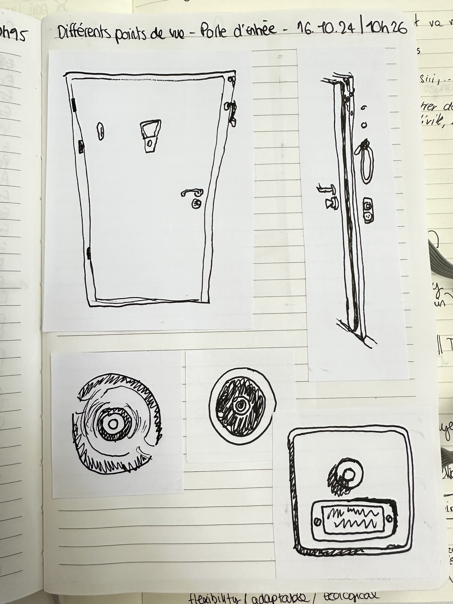
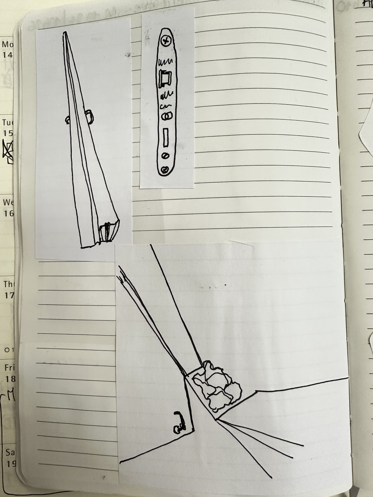
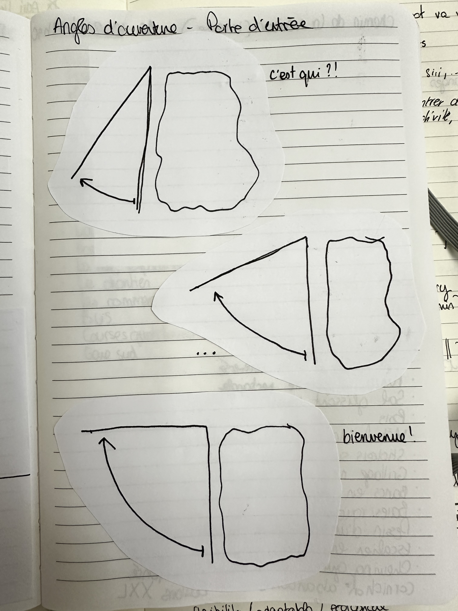
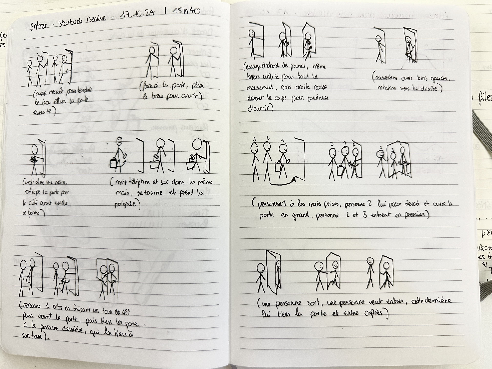
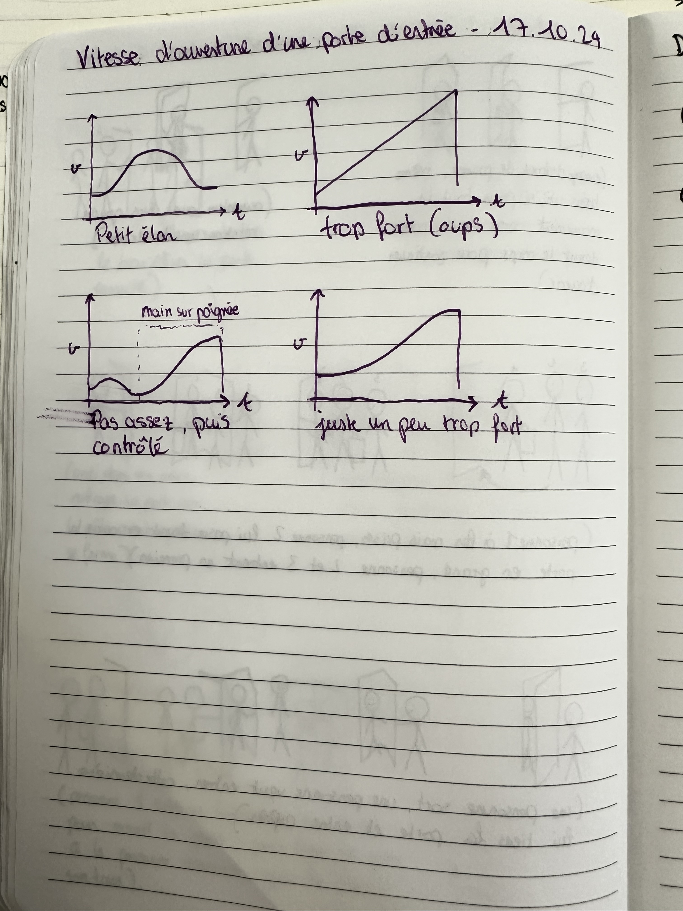
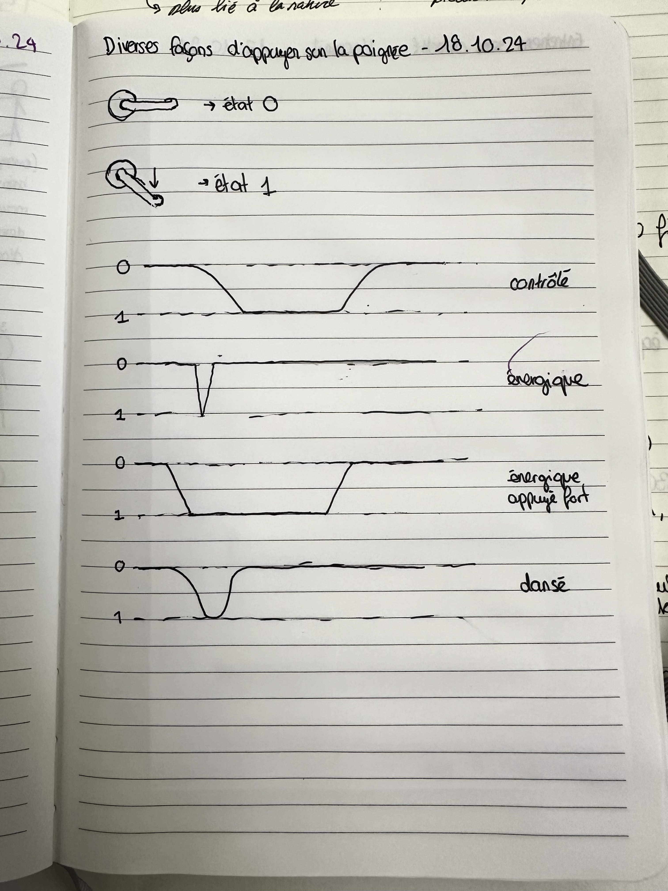
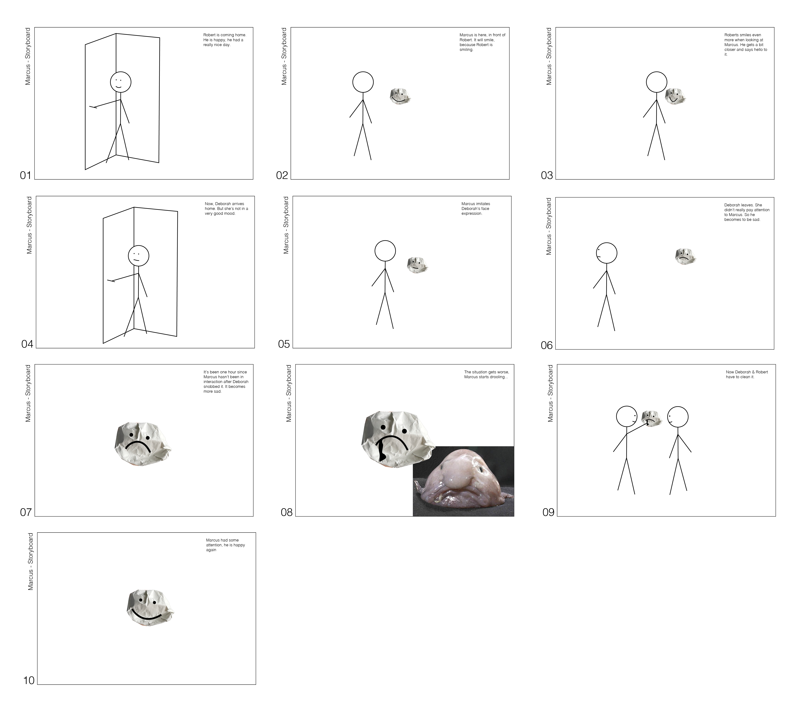
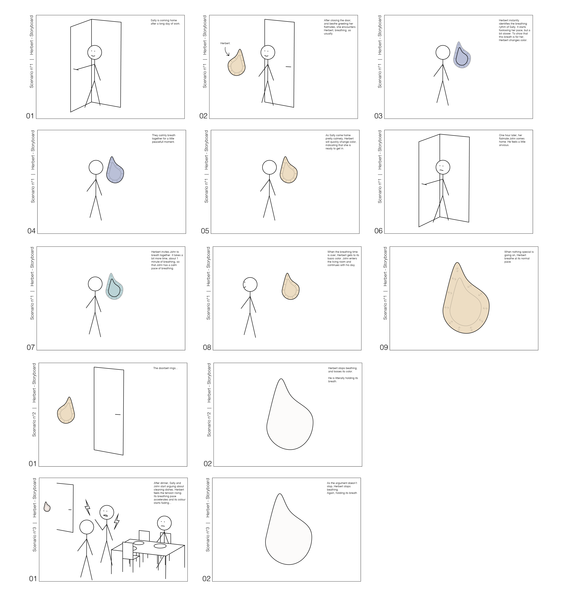

# Tara Hächler
- Soft Robots
- Master Media Design + O2R

## Area of intervention
Transitionning between outside and inside, through the front door. Welcoming ourselves and others. 

## Research Question
- How do we interact with the entry space and the front door ? 

- How does the welcome play a role in our experience of being together ?

## Research
I began by exploring the front door from various angles through drawings. Including sketches of typical entryway objects, like shoes, a doormat, and the doorbell, capturing entrance details.

In parallel, I researched definitions, symbolism, and themes around doors and the act of welcoming. 

I also examined how different angles of the door could be categorized and named.

I became intrigued by habits—the automatic actions we perform daily. I noticed that each person in my home had a similar routine when coming in, yet in a unique order.

Expanding my focus, I observed how people interact with doors in Geneva, sketching people entering and exiting buildings. 

The energy in each interaction inspired me to rethink how to represent this experience.

I interviewed my parents, discussing the meaning of welcoming and being welcomed.

> "Moi, j'ouvre la porte, mais je la garde en main. Au cas où ? C'est pas conscient, je pense. Et puis, une fois que c'est clair, je vais aller, je vais plutôt sortir vers le postier, je ne veux pas qu'il entre."

> "Il y a comme un moment un peu de... Où je me sens un peu flotter, comme ça. Je trouve que c'est un moment qui n'est pas si évident que ça. Parce que, en fait, il y a aussi un petit stress. C'est qu'il y a l'histoire... J'aimerais qu'ils enlèvent leurs chaussures."

> "Déjà, il ne nous saute pas dessus les deux. En fait, c'est très agréable, ça. C'est un qui vient, pas les deux. Et puis, ouais, on a le temps d'arriver. Eux, ils ne sont pas stressés."

Finally, I explored the symbolism of the front door through various texts and metaphors about entry, exit, and passage.

## Insights
One, two, or three (max) insights from your research. Each insight described in one sentence. Example: "Pets can play the role of catalyst for resolving conflict in a couple".

The ways we open doors depend on many things : for ourselves or for someone else, mood, the door itself, what happened before, who is around, why opening that door, etc. 

Having guests may lead you to confront some of your personal boundaries. 

## First ideas & prototypes
Show three of your prototypes.

### Marcus
Marcus is an awkward, drooling blob guest waiting in your entryway, activated by face recognition when you come home. It craves attention and care, responding to gentle looks and expressions. If ignored, it drools, requiring cleaning. Like an uneasy guest, it relies on you to feel welcome.

**Storyboard**

### Baudelaire
Baudelaire is a poetic creature that blocks entry until you share a small story from your day. Once satisfied, it opens and, by day's end, composes a unique story from all inputs received. This ritual encourages daily mindfulness and fosters shared moments through storytelling.

**Storyboard**

<video width="auto" height="auto" controls>
  <source src="../process/images/baudelaire-storyboard_compresse.mp4" type="video/mp4">
</video>

### Herbert
Herbert greets you at the door, syncing its breath with yours to create a mindful pause as you transition from outside to inside. This simple ritual encourages grounding and awareness, gently guiding you to center yourself upon arrival.

**Storyboard**

## Next Steps

I'll focus on simplifying interactions and getting the different robots to work together to create a coherent collection (by triggering a domino effect as soon as you enter the space). I'll also clarify the intention, which is to center ourselves and encourage sharing and act together.