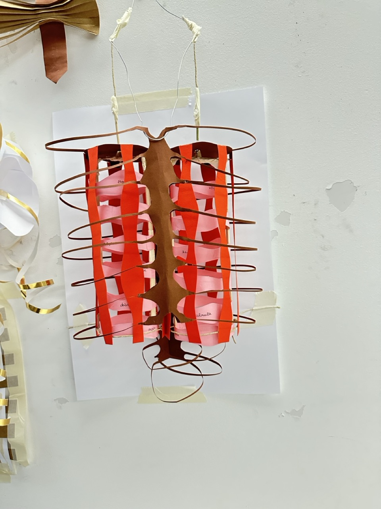
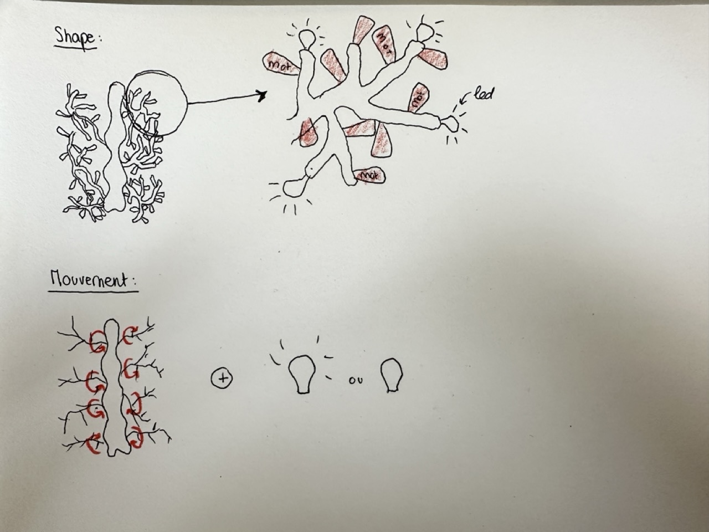
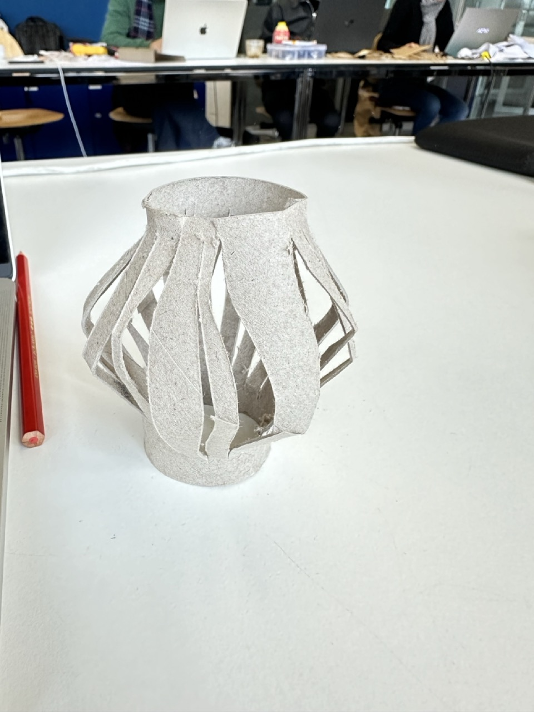
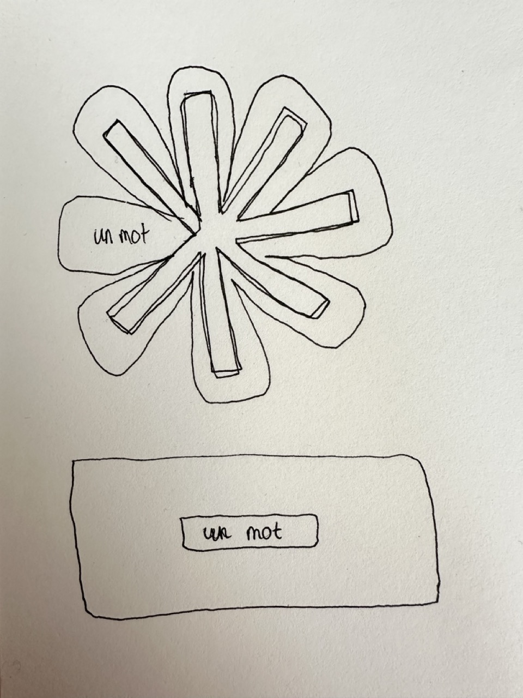

# Tara
- Soft Robots
- Master Media Design + O2R

## Project title 
Crafting organic narratives together.

## Research Question / area of research

- How can we be welcomed at home with something to think about and share?
- How can we add some poetry into the routines of everyday life?

## Pitch

My project is a mural ribcage that tells you a story when you open the front door. 

## Prototyping research
Searching for visual inspirations and experimenting with various paper shapes inspired by these insirations :

Adding the interactive part to the most revelant prototypes :

Trying new ways to add texture :

Sketching/testing other shapes and movements :

  
Finding new inspirations (fortune cookie, carambar jokes, coincoin, wheel of fortune) and sketching other ways to display words : 

---

**Going back to the idea of rolled paper :**

New prototypes for the rolled paper :

## Your key prototype
The concept is to create a passive and poetic interaction with the inhabitants of a home. 
The robot delivers a story written on a roll of paper each time the door is opened.
Certain words are randomly crossed out, leaving only fragments of the text visible, meant to catch the attention of the inhabitants, offering them something to reflect upon, carry with them, or share with others in the household.

## User scenario

## Next Steps
Next, I will continue the electronics, select colors and paper type, determine the dimensions of the weaving strips, test with the Zund machine, decide the displayed text, experiment with pen holder possibilities and create other storyboards for different scenarios.