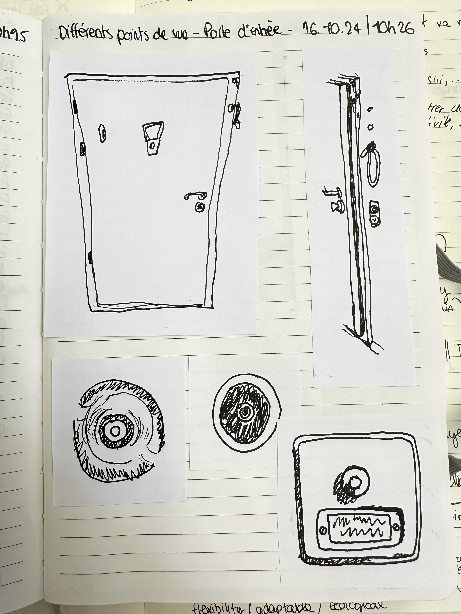
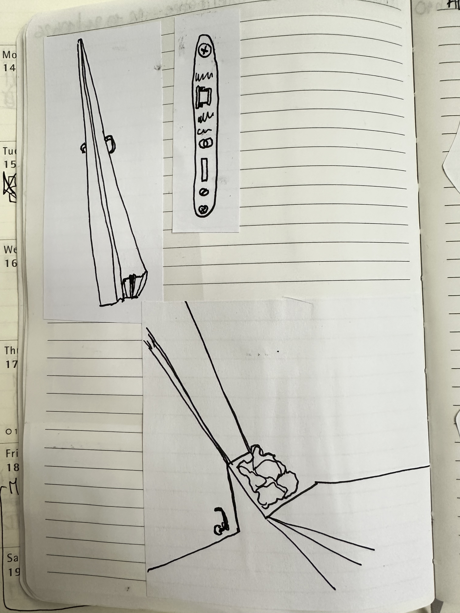
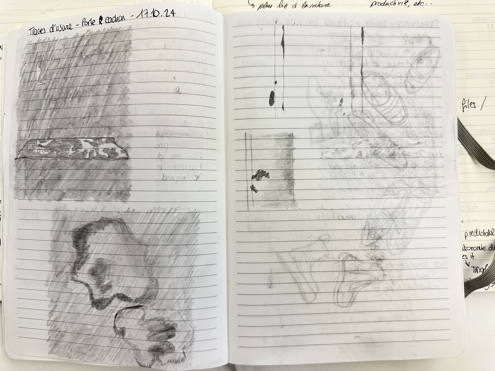
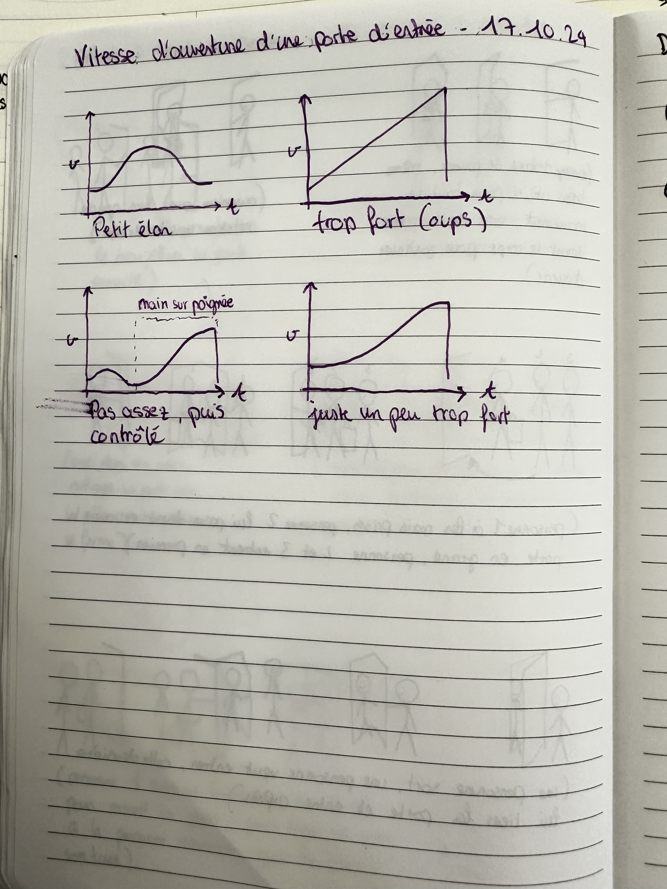

# First Week

## Keywords

Here are some keywords from the first day:  
### Hard Robots
- Rigid
- Industrial
- Mechanical
- Useful
- Productivity
- Labor
- Control
- Dominance / Power
- Straight
- Not easily breakable (tough)

### Soft Robots
- Simple
- Organic
- Nature
- Degradable
- Not easily predictable
- Circular system of action-reaction
- Playful
- Flexible
- Adaptable
- Ecological
- Curved
- Weak
- Pleasing
- Uncomfortable
- Sensitive
- (Other human adjectives)

### General Concepts
- Relationship
- Application
- Interaction
- Scenario

## Questions
- What questions are you asking?
- What do you call intelligence?
- What's the intelligence of water? Of your hand? ...
- What feedback is the robot going to give?
- Where are the problems? What are they linked to?
- Does the robot have to be useful?
- How can the robot be soft not only in the result but during the process and the afterlife of the robot itself?
- If objects are seen as things that have been rigidified, how can we unrigidify them?

## First explorations

  
  

## Context to explore in the domestic space

### First Ideas
- Communication
- Conflict
- The way home
- Arriving at home
- Windows
- Front door
- Colors

### Ideas To Deepen
- The front door
- The entry area
- The concept of welcoming
- Outside / inside 

## Field Research

**Front door**

**Coming home**

**Thematic and definitions**

**Words and stories of opening doors**

**Outside research - humans opening doors**

**Visualize door movements**

**Symbolic research**

  
<strong>Interview</strong>

  [Speaker 1]
  <strong>J’aimerais d'abord vous demander si là, d'un coup, il y a la sonnette qui sonne, et ce n’est pas prévu. Qu'est-ce qui vous passe par la tête ? Qu'est-ce que vous faites ? Ne faites pas ?</strong>
  
  [Speaker 2]
  Moi, ce qui me passe par la tête, ce sont les voisins ont besoin de quelque chose. Et puis, je vais assez vite quand même me diriger vers la porte et ouvrir.
  
  
  [Speaker 3]
  Moi, je cherche tout de suite à... Qui est-ce que ça pourrait être ? Le matin, un postier ou bien un concierge, ou bien un voisin, ou bien... Je fais comme une panoplie de... Si c'était maintenant (20h30), je pense plutôt que ça serait un voisin.
  
  Ce serait très étonnant. Il y a des heures où ça pourrait aussi me faire peur, ou inquiéter.
  
  Le premier truc, ce serait... J'aimerais trouver, mais qui est-ce que ça pourrait être ? 
  
  [Speaker 1]
  <strong>Aucun de vous m’a parlé de regarder par le petit trou qui c’est, vous le faites pas ?</strong>
  
  [Speaker 3]
  Je regardais par l'espion, c'est évident. C'est ça que je voulais dire. Parce que toi, pas (en parlant de Speaker 2).
  
  J'irais tranquillement, doucement, pour qu'on ne m'entende pas.
  
  [Speaker 2]
  Je n'irais pas forcément regarder l'espion. Je n'y pense pas, en fait. 
  
  [Speaker 1]
  Moi, c'est clair, si ce n'est pas la journée, je n'ouvre pas. Je ne vais même pas regarder. Ça me fait trop peur. C’est déjà arrivé. Je pense que c'était un ballon, les voisins.
  
  [Speaker 1]
  <strong>Maintenant... Question, juste pour clarifier celle-ci. Quand c'est un postier, ou un voisin, ou quelqu'un qui est là, mais où ce n'est pas prévu que la personne entre dans la maison, est-ce que vous arrivez à vous visualiser comment vous ouvrez la porte ? Comment se passe un peu l'interaction ? </strong>
  
  [Speaker 2]
  J'ouvre, je vois, ah, c'est le postier. Je lui dis, est-ce qu'il faut signer à quelque part ? 
  
  [Speaker 1]
  Mais tu ouvres complètement la porte, par exemple ?
  
  [Speaker 2]
  Pas complètement mais je crois que je l’ouvre quand même pas mal.
  
  Je ne fais pas juste la tête, non.
  
  [Speaker 3]
  Moi, j'ouvre la porte, mais je la garde en main. Au cas où ? C'est pas conscient, je pense.
  
  Et puis, une fois que c'est clair, je vais aller, je vais plutôt sortir vers le postier, je ne veux pas qu'il entre.
  
  [Speaker 2]
  Moi, moi aussi. Vous, plutôt sortir... Ouais.
  
  [Speaker 1]
  <strong>Et maintenant, comment ça se passe si on attend les invités ? Imaginons, il y a les -- qui viennent à la maison ce soir, et là, ça sonne.
  
  Est-ce que déjà, avant que ça sonne, vous êtes dans l'attente que ça va sonner ?
</strong>
  
  [Speaker 3]
  Oui, oui, il y a l'attente, et puis moi, je n'écoute même pas la sonnerie, j'écoute la porte de l’immeuble, j'entends. C'est très discret, mais je l'entends tout le temps.
  
  [Speaker 2]
  Ouais, moi aussi.
  
  [Speaker 1]
  </strong>Et quand ça sonne, tu vas marcher un pas plutôt normalement pour aller vers la porte ?</strong>
  
  [Speaker 3]
  Ouais, assez rapidement.
  
  Toujours -- qui ouvre.
  
  [Speaker 2]
  Ouais. J'ouvre et puis... Hé, salut.
  
  Il y a comme un moment un peu de... Où je me sens un peu flotter, comme ça. Je trouve que c'est un moment qui n'est pas si évident que ça.
  
  Je crois que c'est un moment que je n'aime pas. Ouais. Ouvrir la porte.
  
  [Speaker 3]
  Ah ouais.
  
  [Speaker 2]
  Parce que, en fait, il y a aussi un petit stress. C'est qu'il y a l'histoire... J'aimerais qu'ils enlèvent leurs chaussures.
  
  Oui. Et ça, ça me stresse. Ouais.
  
  De leur demander ça. Je trouve que c'est... C'est engageant, de ma part, de devoir demander ça.
  
  Et bon, maintenant, ils savent, plus ou moins. Enfin, voilà. Mais quand même, il y a une sorte de...
  
  Aussi... Ah, on va... Ah, du coup, ça me rappelle le Covid aussi.
  
  Parce que, pendant le Covid, tu ne faisais pas la bise. Maintenant, tu refais la bise. Et puis, ouais, la personne, elle entre.
  
  Puis, je suis déjà un peu stressée. Merde, elle va me ramener ses godasses dans mon salon. Il y a déjà une espèce de petite tension, comme ça.
  
  Et puis, ah, on va enlever les manteaux. Merde, on va mettre où les manteaux ? 
  
  On met les manteaux. Ah, il y a le cadeau. Ah, le cadeau.
  
  [Speaker 3]
  Alors, ça, il y a plein de choses où, moi, c'est compliqué. Mais alors ça.
  
  [Speaker 2]
  Et puis, alors, je suis là avec les... Ah, le cadeau.
  
  Merci beaucoup. Merde, qu'est-ce que je vais faire avec ce truc ? Ou bien...
  
  Ah, trop cool. Ouais, ouais, ouais.
  
  Je ne sais pas où le poser. Ah oui, il faut mettre au frais. Il faut de la place dans le frigo.
  
  Putain, il n'y a plus de place dans le frigo. Ouais, ouais, ouais, ouais. Et puis, après, t'es là.
  
  Ah oui, les chaussures. Vous voulez des pantoufles ? Ça, c'est pour dire discrètement, enlevez vos chaussures.
  
  Et puis, les pantoufle sont... Ah, merde, on n'a plus de pantoufles. J'espère qu'ils ne veulent pas des pantoufles.
  
  Non, non, ça va, mon Dieu. Et puis... Mais donc, il y a quand même un côté un petit peu... Il faut que l'invité soit bien. 
  
  [Speaker 1]
  Mais au final, c'est chez toi. Donc, tu pourrais dire, maintenant, t'enlèves tes chaussures. Voilà. Enfin, bon, ce n'est pas comme ça, mais...
  
  [Speaker 2]
  Non, mais bon, mais c'est moi aussi, hein. Moi qui ai beaucoup de peine.
  
  [Speaker 3]
  C'est terrible. Encore, des ouvriers, parfois, c'est parce qu'il y en a qui, avec leur convention, souvent, tout ce qui est électricité...ils sont obligés d'avoir les chaussures. 
  
  Des fois, je préfère enlever le tapis et dire, moi, puis je nettoierai après, plutôt que de demander. C'est terrible, hein.
  
  [Speaker 3]
  Je vais t'accompagner un peu pour le futur, pour ces moments-là. Parce que souvent, moi, je fais un truc dans la cuisine. Je peux dire, moi, moi, ça m'embête, ces premiers moments, parce que c'est un peu...
  
  
  
  [Speaker 2]
  Moi, je sens vraiment que ça me tend. Je sens qu'il y a une tension, en fait, dans ce moment-là. Ah ouais, ouais, ouais.
  
  [Speaker 3]
  Je m'en rendais pas compte avant de te raconter ça. Je me serais jamais posé la question, en fait. 
  
  [Speaker 1]
  <strong>Est-ce que c'est la même chose si c'est -- et -- ? (membres de la famille)</strong>
  
  [Speaker 2]
  Un petit peu. Ouais.
  
  Pas autant. Parce que c'est la famille. C'est un peu plus cool, quand même, pour moi.
  
  Ouais. Mais quand même, il y a quand même un peu... Bah, il y a moins ce truc de faire bonne impression.
  
  Et puis, eux, ils savent pour les chaussures. Et puis, bon, mais... Ouais, mais quand il y a...
  
  Et puis... Oh, -- !
  
  Toi avec tes chaussures. Elle dit... Ouais.
  
  Puis, elle marche sur le tapis avec sa chaussure. T'es là... Mais non !
    
  
  [Speaker 3]
  Ah ouais, mais non, alors ! Elle a fait ça. Mais pourquoi elle a...
  
  [Speaker 2]
  Parce que je pense que ça lui fait un peu chier d'enlever ses chaussures. Et du coup... Ah bon ?
  
  Après, puis... Après, ouais, elles ont quand même enlevé les chaussures. Puis après, elle me dit...
  
  Ouais, mais... Quand tu veux tes godasses, là... Ben, quand on marche sur la terrasse...
  
  Ben, on est quand même... On rentre comme des saloperies. Puis, j'étais là...
  
  [Speaker 3]
  Non, mais après, je lui ai dit un truc. Je m'en rappelle plus quoi, mais j'ai dit...
  
  [Speaker 2]
  Non, moi, je lui ai dit... Mais c'est pas dehors, c'est pas comme des crottes de chien et tout, là, sur la terrasse. Ben, voilà, c'est pas la même chose pour moi. Enfin, voilà, j'ai expliqué, mais...
  
  Mais j'ai trouvé un peu... Ouais, mais elle était pas contente et elle l'a fait savoir. Et je trouve que c'est pas OK.
  
  Parce qu'au final, ça reste chez nous. Donc, tu t'adaptes.
  
  [Speaker 1]
  Oui, parce qu'il y a quand même un peu cette loi implicite qui est de... Quand tu vas chez quelqu'un, tu t'adaptes à sa manière de fonctionner.
  
  [Speaker 2]
  Ouais, tout à fait.
  
  Puis moi, je demande toujours chez les gens. Tu veux que j'enlève les chaussures ?
  
  [Speaker 3]
  Moi, j'enlève aussi toujours. Ils me disent souvent, mais non, pas nécessaire. Je dis, ah non, mais je suis mieux sans.
  
  [Speaker 1]
  Moi, j'aime pas garder les chaussures, en fait. Ouais.
  
  [Speaker 3]
  Moi, -- et --, c'est la même chose.
  
  Là, j'ai même encore... En plus, j'ai peur que --, au premier moment, il va toujours parler super fort. Il va...
  
  Je sais pas si c'est marquer le terrain. Je sais pas. Il va dire fort : Salut !
  
  
  [Speaker 2]
  Mais lui, à chaque fois... Moi, quand j'arrive, je suis là. Ah ! Après, tout va bien. Mais c'est vrai que le début avec c’est fort.
  
  T'es dans le mood, quoi. C'est toujours un peu... Bon.
  
  Un peu too much. Sans manière d’entrer en relation. Mais j'ai peur que... J'ai peur pour mes oreilles quand ils viennent pour le début.
  
  [Speaker 1]
  Et puis, du coup, pour vous, comment faire pour bien accueillir quelqu'un ? 
  
  
  [Speaker 2]
  Alors, moi, je pense déjà ouvrir la porte, assez grand, comme ça. Et puis, dire...
  
  Hello ! Entrez ! Avec les gestes de bras.
  
  Ouais, un peu... Bienvenue !
  
  [Speaker 3]
  Enjouée !
  
  [Speaker 2]
  Ouais, voilà. Un peu... Entrez !
  
  Sentez-vous à l'aise ! Non, mais ne marchez quand même pas sur mon tapis, putain ! Enlevez vos chaussures, merci !
  
  [Speaker 1]
  C'est dur parce que tu dois mettre une limite au moment de l'accueil. 
  
  [Speaker 2]
  Ouais. Et que le moment de l'accueil, il y a un peu ce truc de... Il faudrait faire un truc magnifique.
  
  Un truc un peu... Voilà. Mettre à l'aise.
  
  Et quand tu demandes aux gens d'enlever leurs chaussures, ça casse un peu, quoi. Ouais, c'est ça. Moi, j'ai bien aimé chez --, quand on est arrivés une fois... C'est un collègue à moi.
  
  On était arrivés chez eux. --, sa femme. Elle nous a dit, voilà, ça, c'est le vestiaire.
  
  Voilà, puis... Alors là, vous posez vos vestes. Et puis là... Voilà, là, vous mettez les pantoufles. Et puis... Enfin, genre... C'est hyper organisé, quoi. 
  
  T'as pas le choix. Tu... Tu mets les pantoufles.
  
  Puis voilà. Je trouve ça très bien. Mais en fait, au lieu de demander aux gens...
  
  [Speaker 3]
  Ouais, moi, je trouve surtout... Mais non, j'ai pas envie de mettre les pantoufles. Vous pouvez mettre les chaussures là, c’est chouette. Mais les pantoufles, je trouverais exagéré.
  
  [Speaker 2]
  Non, mais bon, moi, je trouve ça très explicite, on va dire. Qu'on enlève les chaussures chez eux.
  
  [Speaker 3]
  Un exemple. Moi, je trouve très bien aussi mettre les chaussures juste dehors. Ouais.
  
  Comme ça, c'est tellement clair.
  
  [Speaker 1]
  Ouais. Oui, c'est vrai. Ouais, ça, c'est aussi un signe. Ouais, j'aime bien cette thématique des chaussures.
  
  [Speaker 3]
  Moi, pour bien accueillir quelqu'un, ça serait de... De pas trop le stresser. Parce que moi, je pourrais très vite demander... Qu'est-ce que vous voulez boire ? Mais en fait, il veut d'abord raconter le voyage. Il veut peut-être... Ils ont trouvé... Là, il faut... En fait, je pense...
  
  Je suis impatient. Je devrais souvent... Je devrais être un peu plus tranquille. Oui, t'as bien vu. Oui. Oui, la terrasse a changé.
  
  C'est souvent... Ah ouais, de les laisser... Arriver.
  
  [Speaker 2]
  Oui, les laisser arriver. Et ça, souvent, j'ai pas envie. Mais pour bien accueillir, ça serait un peu...
  
  Laissez le temps de... S'adapter au rythme de la personne. Qu'est-ce que vous avez besoin ?
  
  [Speaker 3]
  Ouais, je pense. Ouais, c'est vrai.
  
  Des fois, j'ai l'impression que je suis déjà au taquet, là. Ah ouais ? Bon, allez, on va servir l'apéro, maintenant.
  
  Et puis... Ah, alors, tu veux boire quoi ? Et puis, allez, on...
  
  [Speaker 2]
  Mais du coup, on passe plus un bon moment. C'est horrible, ouais.
  
  Mais en fait, des fois, moi, je peux tellement me foutre la pression que ça peut devenir ça. De recevoir des gens. On prend plus aucun plaisir.
  
  [Speaker 3]
  Ouais, c'est ça.
  
  [Speaker 2]
  En fait, il faudrait peut-être que j'enlève le tapis blanc et puis dire, bon, maintenant, je rentre. 
  
  [Speaker 1]
  Tu sais, c'est le point de friction, le tapis blanc. 
  
  [Speaker 2]
  Ouais, mais c'est le point où, moi, ça me stresse quand même.
  
  [Speaker 1]
  <strong>Est-ce que vous avez des souvenirs de vous sentir très bien accueillis chez quelqu'un ? </strong>
  
  Ou vous vous sentez bien, et ça, pour vous, c'est un bon accueil ? 
  
  [Speaker 2]
  Ouais. Moi, j'adore arriver chez les --.
  
  C'est très agréable. C'est un des deux qui vient nous ouvrir.
  
  Déjà, il ne nous saute pas dessus les deux. En fait, c'est très agréable, ça. C'est un qui vient, pas les deux.
  
  Et puis, ouais, on a le temps d'arriver.
  
  Et c'est confortable chez eux. Moi, j'aime bien. Et puis, tu t'installes sur le canapé.
  
  Et puis... Et puis, après, ils nous servent à boire.
  
  [Speaker 3]
  Eux, ils ne sont pas stressés.
  
  [Speaker 2]
  Voilà, ils ne sont pas stressés. Du tout. Et ça, c'est très agréable, en fait.
  
  Et ça, ça se sent déjà dès l'ouverture de la porte. 
  
  Ouais. Et c'est vrai que nous, on est souvent stressés.
  
  Mais c'était souvent un point que je n'avais plus envie d'inviter des gens, quoi. Pendant la préparation.
  
  [Speaker 3]
  Moi, j'aurais dit chez -. Ah ouais, ouais. Déjà juste arriver. Puis non, on ne va pas tout de suite dans les chambres. Il nous sert à boire, à manger quelque chose. S'asseoir sur la terrasse. Il y a un moment pour arriver comme ça.
  
  Le côté tranquille et détendu aussi. Je pense que ça, ça fait beaucoup.
  
  [Speaker 1]
  <strong>Est-ce qu'il y a quelque chose qui pourrait être lié à des sons ou des odeurs? Parce que quand tu rentres chez quelqu'un, tu rentres aussi dans toute l'atmosphère. Est-ce qu'il y a quelque chose qui peut changer votre vision de l'accueil par rapport à ça ? </strong>
  
  [Speaker 2]
  Ouais, quand ça sent bon. Un repas, un bon repas, un bon gigot dans le four. Tu sens le fumet qui t'arrive dans le nez. C'est clair que ça rajoute un truc à l'accueil.
  
  [Speaker 3]
  Je n'ai pas vraiment de souvenirs comme ça. Mais je pense que je n'aimerais pas entrer à un endroit où c'est trop imprégné. C'est trop dans un truc où c'est dense.
  
  Où il y a de la vapeur de cuisine. Où il y a plein de choses qui se passent, beaucoup de musique. Je n'aimerais pas être à un endroit où il y a, par exemple, la fête. Parfois quand on arrive chez des gens, il y a plein de gens qui sont déjà là.
  
  Il y a de la musique. Tu n'entends déjà pas ce que l'autre dit. Ce n'est pas un accueil agréable.
  
  [Speaker 2]
  Je suis d'accord si c'est un truc avec plein de gens.
  
  [Speaker 1]
  C'est vrai que ça dépersonnalise l’accueil. Plus il y a de monde.
  
  
  [Speaker 2]
  C'est vrai, des fois... En fait, ça ne me stresse pas quand on arrive chez ma sœur, mais des fois, on les sent tendus, mais bon, après, ça va. Ça, j'ai pu sentir une fois ou autre.
  

## Main Insights

### Humans and Doors
The way we interact with a door depends on various factors. First, it’s shaped by the context:

Is it a public or private space? Are there people around? What is the purpose of opening the door? Is the door familiar? Does it conform to standards we subconsciously recognize?

Especially in a private setting, how we approach a door can be influenced by additional elements:

Who are we opening the door for? Are the people behind the door known or unknown? Was this interaction expected?

What emotional state is the person in? Does the act of opening the door fit into a habitual routine (e.g., returning home after work)? What events led up to the moment of opening the door?

### Welcoming People at Home
Welcoming guests into your home involves many emotional and relational aspects. Beyond the emotional state of those involved, the experience can be shaped by other factors:

Who are the guests? How close are you to the person entering? What is the context of the visit? What are the expectations?

What are the host’s boundaries? How easily can they communicate those boundaries?

Are there any unforeseen elements impacting the welcome? How flexible is the host in adapting to the unexpected?

### Being Welcomed into Someone Else's Home
The experience of being welcomed also hinges on several factors:

Whose home are you visiting? Have you been there before? How do you announce your arrival? Who greets you? What sounds and smells are noticeable at that moment? Do the people welcoming you show signs of stress, tension, or something else?
