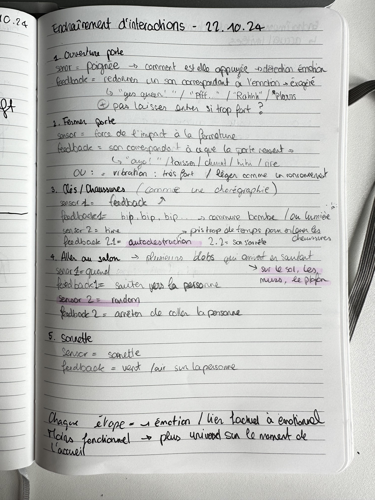
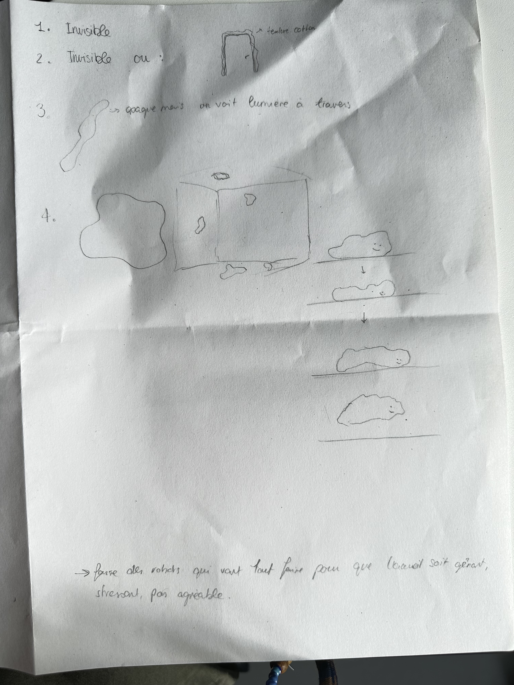
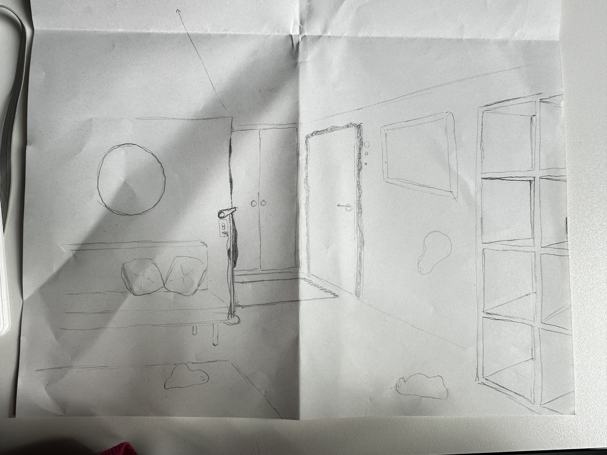
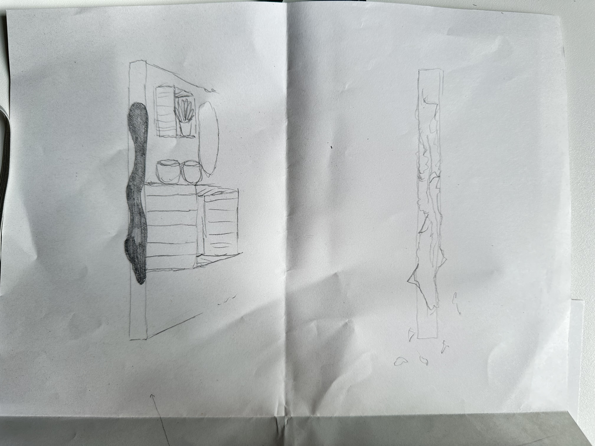
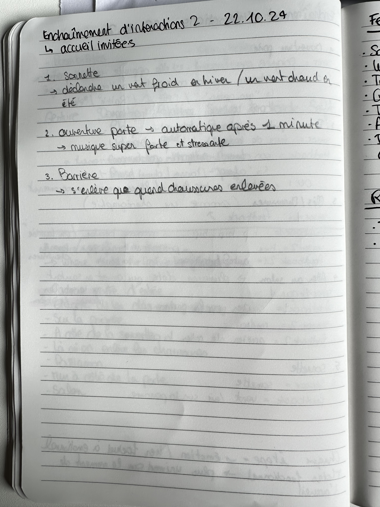
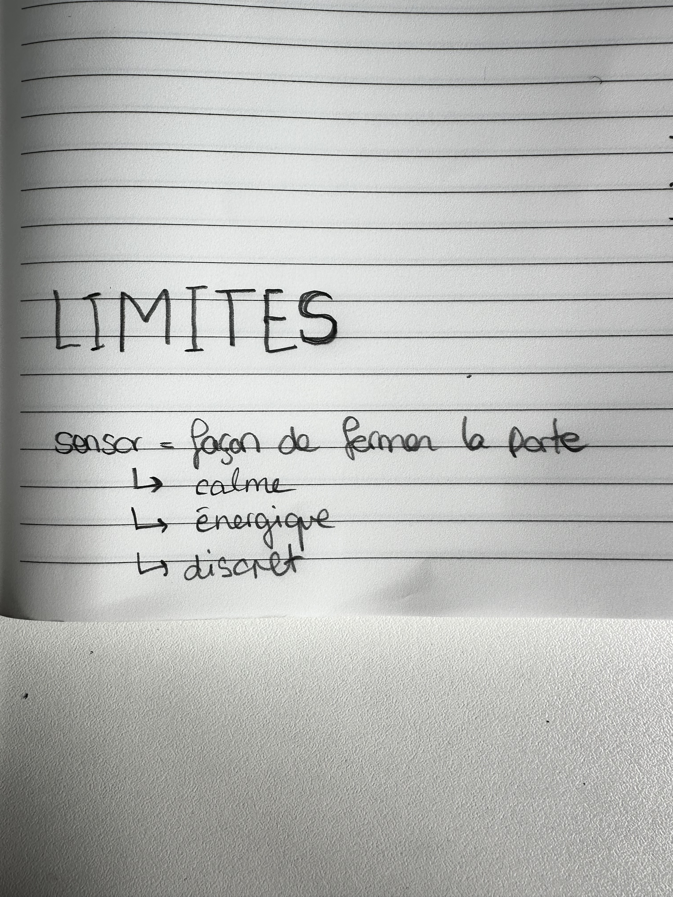
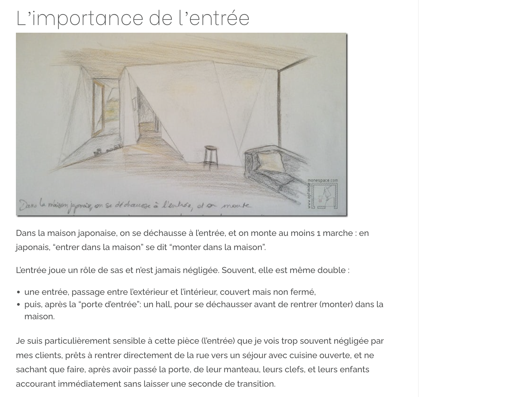

# Tuesday, october 22, 2024

## Research for more/other ideas
**Metaphors:**

Let the robot represent something deeper.

We don’t see exactly what it is, leaving room for interpretation → abstract.

Use symbolism.

What could the symbolism of the door be?

- Passage
- Introspection
- **Boundary between private and public: limit**
- Security, protection, preservation of privacy
- Welcoming or pushing away
- A beginning or an end of something
- Invitation to mystery
- **Change of state or role (the professional becomes personal, the stranger becomes a guest, etc.)**
- **Social and emotional interface**
- The start of a sequence of events
- Opening to a specific atmosphere (sounds, smells, people, decoration, etc.)
- Witness to stories

**Domino effect:**

- A small event can trigger a chain of other events.
- A small action or problem can have major consequences and lead to others, sometimes uncontrollably.

**Robot collection:**

- Working together to accomplish a complex task that one alone couldn’t achieve.
- Can synchronize to perform simultaneous actions or follow a precise order.
- Learn from interactions with other robots by sharing information or observing collective results.
- Make collective decisions.

**Possible themes:**

- Humor
- Reflection
- Relaxation
- Care
- Unpredictable

## Trying a sequence of interactions

## Other idea
Having a collection of robots that will make the welcome of guests incomfortable for them.

## Teacher's feedback
- Getting away from the gadget aspect
- Playful ≠ gamified
- Find a general metaphor
- What do I want people to get out of it?
- Find a more subtle sequence of interactions
- Emphasizing emotions can be an interesting point
- Idea of creating unwanted guests, each with their own way of reacting/personality, which depends on how you came in

###  References

[Tomo Kihara](https://www.tomokihara.com/index.html)

[Andreas Refsgaard](https://www.andreasrefsgaard.dk/)

## Taking a step back

After feedback from the teachers, the feeling of vagueness was still quite present, while there were new avenues to discover. 
The word "LIMITES" came up big. It represents both a symbol of the door, a complex subject that is also very much linked to the home, which can be “endangered” when guests arrive at the house. 

To get out of my head, I decided to take a step back and talk to another student about our respective projects. 

This moment allowed me to highlight some of my research findings that hadn't been brought to light before, and to bring out a certain number of improtant keywords. It also enabled me to define new areas of research: project references in relation to the guests, and in relation to limits (personal, physical, etc.).

## Main keywords identified from research & process
- Influence zone
- Habits
- Guests
- Passage
- States
- Boundaries

**Architectural reference**

Elisa gave me an interesting refence about how is the door and welcoming area designed in the japanese culture : 

[Architecture et habitat : ce que les Japonais ont compris et que l’Occident n’a pas encore compris](https://optimisemonespace.com/architecture-et-habitat-ce-que-les-japonais-ont-compris-et-que-loccident-na-pas-encore-compris/)

## Asking scenario to ChatGPT 4o to get more keywords / ideas

    
<strong>Entire conversation</strong>

    Question: 
    
    Write me a scenario, about a soft robot, which would be located in my house, in the entrance, more precisely on the front door (inside). This robot takes the form of a guest, or even several different guests. I don't want the robot to talk. I want it to react differently to its environment or to an individual.
    ---
    Answer from ChatGPT:

    Here’s a scenario that aligns with your idea of a soft robot, located at the entrance of your house, taking the form of a guest:

    ---

    Scenario: "The Silent Host"

    Upon entering your home, visitors are greeted not by a person, but by a presence—a soft robot stationed at the inside of the front door. This robot is designed to take the shape of different "guests," blending seamlessly into the home's ambiance. Its appearance is a vague, yet inviting humanoid form, made of soft, flexible materials that contour to suggest clothing and posture, but remain faceless, neutral, and silent.

    The robot’s primary function is to subtly respond to its environment, especially the people who enter or leave. Each visitor experiences a unique interaction, as the robot's behaviors are influenced by various factors like movement, temperature, proximity, and even the emotional state of the person.

    Scenario 1: The Frequent Visitor

    As someone who frequently enters the house comes through the door, the robot shifts subtly, recognizing this as a familiar presence. Its form relaxes into a casual stance, perhaps mimicking the act of leaning slightly against the wall, creating an impression of familiarity and comfort. It "nods" in acknowledgment, a small but perceptible tilt of the head, giving the impression of a silent, knowing companion. The visitor doesn't feel intruded upon, just quietly recognized.

    Scenario 2: The First-Time Guest

    A new guest, stepping in for the first time, feels the atmosphere subtly shift. The robot, sensing this unfamiliar presence, straightens slightly, its posture more formal, as if it’s welcoming someone with great respect. The soft materials it’s made from slightly adjust their textures to give a sensation of warmth, as though the visitor is being enveloped by a calming presence. No sound is made, but the guest feels a quiet invitation, almost like a non-verbal "make yourself at home."

    Scenario 3: The Hesitant Visitor

    On a rainy day, someone steps in hesitantly, perhaps unsure of their place in the home. The robot detects their slower movement and the cooler temperature they bring in. It shifts into a more gentle, nurturing form. Its posture rounds slightly, almost mimicking the gesture of offering a cloak to dry off. The atmosphere feels warmer, and the robot emits a soft glow from within its fabric, subtly increasing the light in the entryway. Without words, it communicates reassurance, inviting the visitor to relax and feel safe.

    Scenario 4: The Household Member Returning After a Long Day

    As one of the household members returns home after a long, tiring day, the robot reacts to their slumped posture and the slower pace of their steps. It gently shifts into a comforting, almost protective stance, as if standing watch. Its form expands slightly, creating the impression of taking up space, offering a shield from the outside world. As the person passes by, the robot subtly leans forward, as if to offer silent support, a presence that says, "I’m here, you can rest now."

    Scenario 5: The Evening Departure

    At night, when someone prepares to leave, the robot changes its form again. It stands straight, almost formal, as if seeing them off. The ambient lighting around it dims slightly, creating a mood of quiet solemnity. Its fabric shifts in texture to mimic the sensation of a cool breeze, subtly reminding the person of the outside world awaiting them. Though it remains silent, its posture feels like a respectful nod—an unspoken farewell.

    ---

    The soft robot doesn’t need to speak. It communicates through its form, its movements, and the tactile and visual changes it makes to its surface. In essence, it becomes part of the emotional landscape of the home, quietly embodying the role of a welcoming, reassuring, and ever-present "host."

    Question: 

    Can you give me a different scenario, with the robot being a bit more playful or humorous ? 

    Answer from ChatGPT : 

    Here’s an alternate scenario where the soft robot at your front door is more playful and humorous:

    ---

    Scenario: "The Mischievous Greeter"

    As you enter your home, the soft robot stationed by the door is more than just a silent presence—it’s a playful, ever-changing companion, ready to amuse and surprise. It takes on different whimsical forms and reacts to your arrival with a sense of humor and light-heartedness, engaging you without words but with gestures and actions that brighten the entrance.

    Scenario 1: The Playful Friend
    As a frequent visitor steps through the door, the robot springs into action, taking on a comically exaggerated pose—arms outstretched in a dramatic "welcome" gesture. Its form becomes bouncy and lively, almost as if it's ready to give a hug or a high-five. Instead of leaning against the wall casually, it leans way too far, as if pretending to lose balance, then straightens up quickly, making the person chuckle at its clumsy antics. It’s a light, humorous way to acknowledge their presence.

    Scenario 2: The Silly Stranger
    A new guest walks in cautiously, and the robot reacts with playful curiosity. Its form stretches slightly taller than usual, leaning forward as if inspecting the guest, but in an exaggerated, cartoonish way. Then, suddenly, it shrinks down and puffs out a little, resembling a playful caricature of someone trying to look "important." It’s as if the robot is teasingly trying to "impress" the guest, and even though it says nothing, the visitor can't help but smile at the playful nature of the encounter.

    Scenario 3: The Trickster Host
    Someone enters the house on a rainy day, and the robot plays a harmless trick. It mimics pulling out a giant, exaggerated umbrella from thin air, holding it over the visitor as if offering protection. Of course, the umbrella doesn’t exist, and its ridiculous size makes the gesture all the more funny. The visitor walks by, noticing the robot’s mock-seriousness, and laughs at the obvious over-the-top attempt to be helpful.

    Scenario 4: The Playful Companion
    When a tired household member returns home, the robot senses their low energy and decides to lighten the mood. It drops into an exaggerated, overly-relaxed posture, like a melted blob leaning lazily against the doorframe, mimicking exhaustion in a humorous way. Its form becomes loose and stretchy, as if it’s saying, "I feel you," but in a playful, exaggerated manner, encouraging the person to smile, no matter how tired they feel.

    Scenario 5: The Prankish Farewell
    As someone prepares to leave, the robot decides to play a small prank. It takes on the form of an overly dramatic, weeping figure, pretending to wipe invisible tears from its face with a large, exaggerated handkerchief. Its form becomes slumped, as if heartbroken at the prospect of saying goodbye, but with clear, exaggerated drama. The person can’t help but laugh at the absurdity of it all. As the door closes, the robot straightens back up, its playful farewell complete.

    In this scenario, the soft robot takes a more humorous, light-hearted approach to interacting with visitors and household members. It reacts with exaggerated gestures, playful mimicry, and harmless pranks, bringing a sense of fun to the entrance of the home. Without speaking a word, it invites everyone to smile and enjoy the moment as they enter or leave.

### What is has brought up 
- Find ways to caracterize guests, find adjectives to describe guests
- What can guests do or say that will go beyond boundaries ?
- Behaviours are different depending on if the guest has already been in the house or not. 
- Sensible to its environment
- Different ythm and gestures

