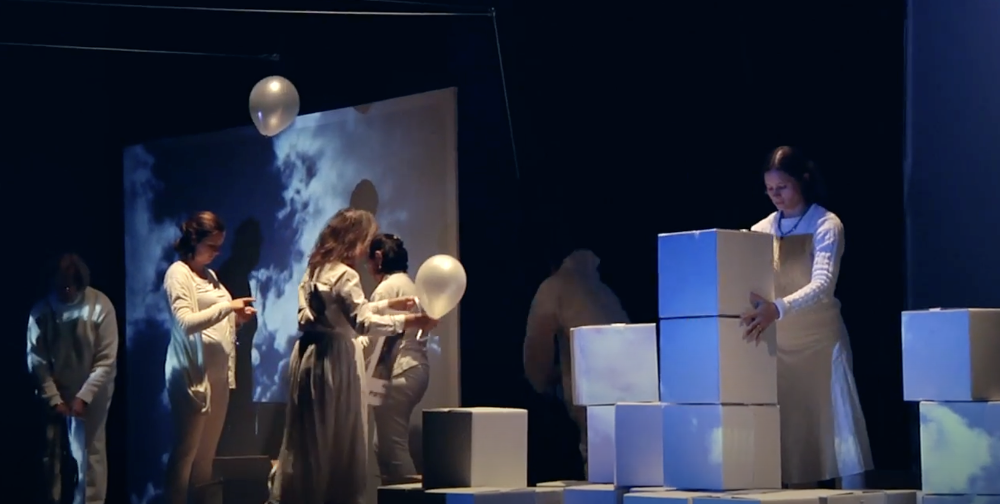

# Wednesday, october 23, 2024

## Research around guests
The invitation
- The art of inviting or being invited
- Collaborative design
- The host-guest relationship
- In what context do hosts and guests meet?

### *Apparition* from Guy de Maupassant

[Entire nouvelle on wikisource.org](https://fr.wikisource.org/wiki/Clair_de_lune_(recueil,_1884)/Apparition)

**Notes:**
- Going into another's home without him/her 
- The privilege of entering (having the right to enter)
- Difficulty or not in opening a door
- First thing you notice when entering: the light and the smells
- “dead rooms"
- Unexpected guest
- Ghost?
- “a soft, painful voice that rattled the nerves”.
- Guest frightened because the host has some kind of unconscious “power”?
- “I rushed to the door by which this being had left. I found it closed and unshakeable.”
- Closed door: confinement 
- “a fever of flight invaded me”.
- Departure or flight? -> see the definition of these words

### A guest can be:
(some elements have been added to the inital list thanks to ChatGPT 4o)

- A friend
- A stranger
- A neighbor
- A family member
- A worker (e.g., a plumber, electrician)
- The police
- A doctor
- A delivery person
- A salesperson
- A teacher or mentor
- A government official
- A distant relative
- A colleague

### A guest can behave:
(some elements have been added to the inital list thanks to ChatGPT 4o)

- Politely
- Impolitely
- Playfully
- Seriously
- Silly
- Shyly
- Awkwardly
- Stressfully
- Friendly
- Unfriendly
- Calmly
- Aggressively
- Nervously
- Confidently
- Curiously
- Indifferently
- Overwhelmingly (e.g., over-enthusiastic)
- Distractedly
- Invasively
- Recklessly
- Intensely
- Domineeringly
- Self-centeredly
- Joyfully
- Generously

### (Hard) Robots in Hotels:

[Article from provenrobotics.ai](https://provenrobotics.ai/enhancing-guest-experience-the-role-of-robots-in-hotels/)

**Role of robots**:

- Robots improve efficiency by handling repetitive tasks such as cleaning, security, and room deliveries.
- They free up human staff to focus on complex tasks and customer communication, enhancing the overall guest experience.
- Robots are used for check-in, concierge services, providing information, and guiding guests.
- They increase safety by monitoring the premises and detecting potential risks.

**Benefits for users**:

- Improved speed and convenience for guests, especially with contactless services and multilingual assistance.
- More interactive experience compared to static screens, reducing perceived waiting time and making the stay more enjoyable.

**User appreciation**:

- Younger generations, in particular, appreciate the personalized interaction and convenience of robots, though some still prefer human contact for the empathy and personalization that (hard) machines cannot offer.

**Limitations**:

- High cost of purchase and maintenance.
- Robots offer a lower level of personalization and empathy compared to human interactions.

### Aibo Robot Dog

[Article from spectrum.ieee.org](https://spectrum.ieee.org/sony-advanced-aibo-robot-dog-unleashed)

**Role of Aibo**:

- The new Aibo is an entertainment robot with advanced mechatronics and AI, featuring 22-axis movements for smoother, more natural body motions.
- Equipped with cameras and sensors, Aibo recognizes its owner’s faces and adapts to its environment using SLAM technology.
- Aibo creates a bond with its owners through its ability to analyze praise, interpret smiles, and respond to physical interactions like petting.

**Features**:

- Aibo is more dog-like, expressive, and cuter than the original, with OLED screens in its eyes to enhance expressiveness.
- Aibo weighs 2.2 kg and has compact dimensions for a lifelike appearance and movement.
- It includes a cloud feature that allows owners to share and extend the robot's learned behaviors across other Aibos.

**Target Audience**:

- Sony expects Aibo to appeal to older customers in their forties and fifties, as well as to children, aiming to sell at least 150,000 units, similar to the original version.

**Cost and Subscription**:

- Aibo costs approximately $1,750, with an additional subscription required to access all its features, such as photos, apps, and a virtual version of Aibo.
- Subscription plans range from $800 for a basic plan to $475 for repair support.

**Potential Applications**:

- Aibo's connectivity through a SIM card allows for integration with home appliances and future possibilities for educational or personal assistant roles, though details on those features are yet to be provided.

**Future Outlook**:

- Sony is testing the success of Aibo in Japan before expanding sales overseas and is considering further developments in entertainment robots.

### Movie *Guest* from 2020
- **Director and Writer:** Finn Callan
- **Release Date:** 27 August 2020 (FrightFest), 24 December 2020 (YouTube)
- **Genre:** Psychological horror
- **Plot:** A young woman encounters a mysterious creature and wakes up injured in a strange place.
- **Reception:** The film received positive reviews for its direction, cinematography, monster design, and special effects.

**Why is this creature named "Guest," given that it doesn’t seem to have been invited?** *(ChatGPT 4o)*

The creature in *Guest* is called "the Guest" for several symbolic and thematic reasons. The term "guest" often suggests an unwanted presence that invades someone's personal space, reflecting the psychological and physical intrusion Mary experiences. While the concept of a guest typically implies some familiarity, in this case, it's the opposite: the creature represents a terrifying intruder who disrupts Mary’s life.

Moreover, the idea of a guest ties into themes of fear and vulnerability. In the film, the guest embodies Mary’s anxieties and traumas, highlighting how past experiences can haunt someone, even when they try to hide or protect themselves. The choice of this name reinforces the idea that, although the creature is not welcome, it remains ever-present and inevitable, amplifying the psychological horror of the narrative.

## Research around boundaries

### *Penalty Box* by John Dykstra

[Article from nonoawards.com](https://monoawards.com/winners-gallery/monochrome-awards-2016/professional/fine-art/hm/3516)

### *hromady suti de* by The Rodina

[From typographicposters.com](https://www.typographicposters.com/the-rodina/594953641abbcb141757b1e6)

### *The Sky Is the Limit: A Happening* by Geoffrey Hendricks

[Watch the video on YouTube](https://www.youtube.com/embed/0mb2mFWa_O0?si=wfeb8t3hGVgPJWYE)

### Reflection of cars and their lights on the ceiling creates soft patterns
<video width="auto" height="auto" controls>
  <source src="images/plafon-tunel.mp4" type="video/mp4">
</video>

## Existential crisis
What do I want us NOT to get out of it?

(easier to know what I don't want)
- A gadget
- A game
- Something useless 
- Useless technology
- Helping to be more productive
  

What do I want us to get out of it?
- Accentuate emotions ?
- Futur-oriented
- Fantasy
- Usefull
- Something evolving, never the same state
- Pay attention
- Act together

Something that you have to take care of ?

From *Coding care* - edited extract from *Ways of Being. Beyond Human Intelligence* by James Bridle

-> something that will make us want to work together, something that brings us together

-> now, how can I link all of this to a soft robot, that would be placed in the entry of our homes, that would be maybe acting like an unwanted guest, or just a guest, and maybe playing with our boundaries ?

## Idea 1: A BLOBBBB :)
That would act like you, with your face, when you enter.

Then, when you're in your home but not paying enough attention to it, it will become drooling. 

If there is a lot of people in the home, it is important that differents persons of the house pay attention to it. It will be even more happy if you come to it together will different people. 
To pay attention is to do faces, to look at it gently.

If it is drooling, you will have to clean it, it is your home. You don't want it to be dirty with some creature drool everywhere. 

When you're not there, it will just sleep and wait for you to come home.

The blob is constantly evolving. 

-> it's an unwanted guest because you have to take care of it, you have to make it feel good and at home, when it drools, you have to clean it. Like when you have guests at home that spill something on the floor, OR THE WHITE CARPET, you will clean. Because you don't want the guest to clean, right ? And also, are you sure the guest will clean like you want it to be clean ? You better clean it by yourself.

It acts like a shy awkward guest, that doesn't feel at ease but doesn't want or isn't capable of telling it to you. 

### How to create emotion on a blob with no eye, mouth ?

My main reference for the blob : 

Don't you want to take care of him(her ??, it ?) ?

Saddy : 

Happy : 

Comme-ci comme-ça : 

Drooling :( : 

<video width="auto" height="auto" controls>
  <source src="images/drool.mp4" type="video/mp4">
</video>

### Pareidolia
**Defintion ([Wikipedia](https://fr.wikipedia.org/wiki/Par%C3%A9idolie)):** Pareidolia is the process of recognizing a familiar shape in a landscape, a cloud, smoke, an ink blot, etc., a human voice in a noise, or even words (usually in one's own language) in a song or speech in a language one doesn't understand.

Conversation with ChatGPT 4o : 

### *Question:*

How can I use Pareidolia to recreate emotions on something that doesn't have any eyes, mouth, or nose ?

### *Answer from ChatGPT:*

Pareidolia is the human tendency to perceive familiar patterns, especially faces, in random or ambiguous stimuli, like clouds or abstract shapes. You can use this phenomenon to evoke emotions on objects that lack traditional facial features (eyes, mouth, nose) by manipulating form, color, movement, and context. Here's how:

**Shape and Form**:

- Use abstract shapes hinting at human figures (curves, symmetry).
- Arrange elements to mimic face-like features (suggesting "eyes" with paired shapes).

**Light and Shadow**:

- Play with shading and lighting to suggest depth or emotion.
- Use contrast to highlight areas, guiding viewers to perceive "features."

**Color**:

- Choose emotive color schemes (warm = comfort, cool = calm, contrast = mystery).
- Use gradients to imply emotional shifts (brightening = excitement, darkening = sadness).

**Movement**:

- Gentle movements evoke peacefulness, sudden movements suggest anxiety.
- Subtle shifts mimic body language, creating emotional perception.

**Texture and Material**:

- Soft textures suggest warmth, hard textures evoke tension or coldness.
- Responsive surfaces (flexible materials) suggest life and reactivity.

**Sound and Vibration**:

- Soft sounds evoke calm; louder or irregular noises imply tension.
- Rhythmic feedback (breathing-like vibrations) mimics life and emotions.

**Context and Interaction**:

- Place the object in settings that suggest interaction or observation.
- Create responsive interactions (motion, touch) to evoke emotional dialogue.

## Idea 2: A picky bell
It would be a robot that would replace your doorbell. Depending on the time, the way the bell is pushed, and the person that is behind (someone the bell sees everyday for example) it would or not make the sound of the bell work. 
The bell will decide for you if it is the right time to be bothered or not.

### Various doorbells

**My family’s doorbell stopped working a week or so ago. We had to improvise.**

[Reddit post from violinfiddleman](https://www.reddit.com/r/funny/comments/oxczec/my_familys_doorbell_stopped_working_a_week_or_so/)

**Doorbell for dogs**

[Amazon page](https://www.amazon.com/weird-tails-Waterproof-Operating-Transmitters/dp/B07Q9PSKT8?th=1)

**Doorbell Letters for Modern Victorians**

[Article on gardenista.com](https://www.gardenista.com/posts/object-of-desire-doorbell-numbers-mark-lewis-modern-victorians/)

**150+ Funny Ring Doorbell Names**

[Article on namescrunch.com](https://namescrunch.com/funny-ring-doorbell-names/)

### Signs near doors

[From u-buy.ch](https://www.u-buy.ch/en/product/8CZKZC0O6-no-soliciting-sign-for-house-funny-personalized-signs-for-home-front-door-seriously-don-x27-t-knock-or-ring-doorbell-don-x27-t-make-it-weird-5x10?ref=hm-google-redirect)

[From Amazon](https://www.amazon.com/VSIIKO-Sarcastic-Personalized-Neighbors-Listening/dp/B095C2PSLY/ref=asc_df_B095C2PSLY?tag=ushpadpinsp-20&hvdev=m&hvpone=626746607997&hvptwo=2680072520361&hvqmt=4260607992805&hvadid=4672928966045&psc=1&pp=1)

[From u-buy.ch](https://www.u-buy.ch/en/product/M09KM6KFM-please-remove-your-shoes-sign-no-shoes-sign-for-house-shoes-off-sign-for-front-door-welcome-decor-please-take-off-your-shoes-sign-housewarming)

[From u-buy.ch](https://www.u-buy.ch/en/product/FU3D83968-my-word-welcome-black-welcome-sign-and-porch-leaner-for-front-door-porch-yard-deck-patio-or-wall-indoor-outdoor-decorative-farmhouse-rustic)

### Doormats

[From rosesttradingco.com](https://rosesttradingco.com.au/products/classic-welcome-embossed-doormat)

-> does not really is in link with the idea of getting together / taking care together
