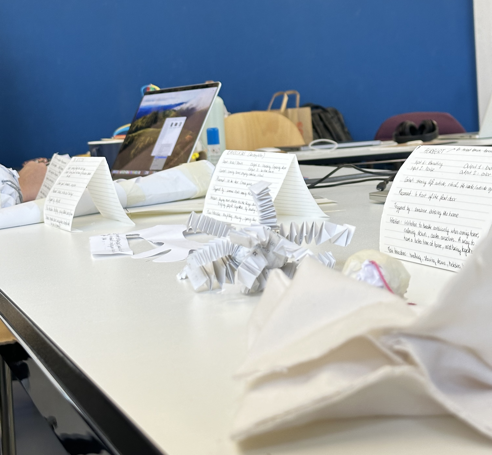

# Wednesday, november 06, 2024

## Protoypes presentation

### 1. Marcus 
***(Psychrolutes Marcidus → Blobfish)***

- INPUT : Face recognition
- OUTPUT : Face expression / drooling

- CONTEXT : Coming home & being at home

- PLACEMENT : in the entry

- TRIGGERED BY : Someone arriving home
  
- MAIN INTERACTIONS : Attention, emotions, face

- INTENTION : It's an unwanted guest because you have to take care of it, you have to make it feel good and at home, when it drools, you have to clean it. Like when you have guests at home that spill something on the floor, or the white carpet, you will clean. Because you don't want the guest to clean, right ? It acts like a shy awkward guest, that doesn't feel at ease but doesn't want or isn't capable of telling it to you.

### 2. The Detective
***(Bull’s Eye)***

- INPUT : Looking through the bull’s eye
- OUTPUT : Turning around the head of the person in front of the door

- CONTEXT : Guests, boundaries, suspicion

- PLACEMENT : On the door bull’s eye, outside
- TRIGGERED BY : Looking through the bull’s eye / Ring bell
- MAIN INTERACTION : Analyzing, giving perspectives
- INTENTION : Represents distrust, exaggerating it, perhaps to ask the question, why so much distrust of strangers, of foreigners? Making the futur potential guest uncomfortable before coming in

### 3. Baudelaire
***(The Storyteller)***

- INPUT : Stories / Voice
  
- OUTPUT 1 : Blocking / Opening door
  
- OUTPUT 2 : Written story (with every input received during the day)
  
- CONTEXT : Coming home, paying attention, ritual
- PLACEMENT : On the door
- TRIGGERED BY : Someone starts opening the front door from outside
- INTENTION : This forces you to pay attention during your day + it brings people together because there’s a moment of sharing, which could perhaps spark the beginnings of a conversation.
- MAIN INTERACTION : Storytelling, sharing

### 4. Herbert
***(Dr. Herbert Benson, Harvard University)***

- INPUT 1 : Breathing
- INPUT 2 : Noise
- OUTPUT  1 : Breathing
- OUTPUT 2 : Color
  
- CONTEXT : Stressing life outside, symbolic of inside/outisde, ritual, entity
- PLACEMENT : In front of the front door

- TRIGGERED BY : Someone entering home
- INTENTION : An invitation to take a little time, during the transition between outside and inside, to breathe consciously. Breathing as a way to calm ourselves down. Center ourselves.
- MAIN INTERACTION : Breathing / slowing down / holding breath

## After feedback

### Simplifying

Creating a serie of robots that work together. To do this, I'll have to simplify the interactions of each robot. The ideal would be that each of them have only one input, and one output. Would also be great that the output triggers the next robot. To do this, I may have to split a robot into 2. 

### Clarify the intention

### Make the intention stronger in the robots
