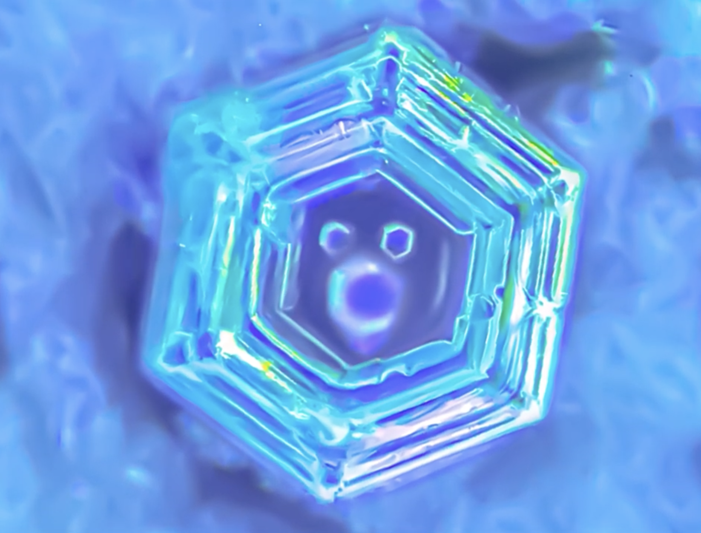

# Thursday, november 07, 2024

## Feedback from mid-crit presentation

### Interesting thematics 
- Personification of the house
- Softness as a process
- Find new methodologies

### Create creatures
- Make more awareness about the why
- Use work that already exists and simplify, or make it yours
- Maybe better to avoid too much complexity
  
### Consciousness
- Can be hard to create
- Projecting consciousness into objects
- Play with the consciousness we give to objects

## Keywords / things that arised during that day
- What is soft to me ?
- Inverse the status -> people from outside that can see inside ?
- Knocking on doors (sounds, mouvements, why 3 times ?)
- How to make the door more universal ?
- Imperfection
- Unpredictable

## Pareidolia (see faces without a face)
That weird moment when you have to describe the shape you see in the cloud to someone who doesn't sees it. 

### Caracteristics
- Angle we see it from
- Temporary (doesn't look always same)
- Natural randomness
- Placement of forms
- Forms and shapes

### Faces in Nature

### Creatures/animals in nature

### Creatures from human made

### Mix from human and nature

### Pareidolia in art

### Pareidolia in water

[See entire video on Youtube](https://youtu.be/ZZ1vWDn6Wgg)