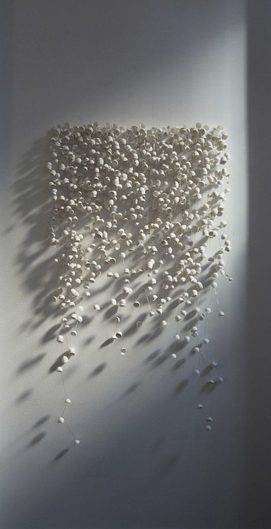
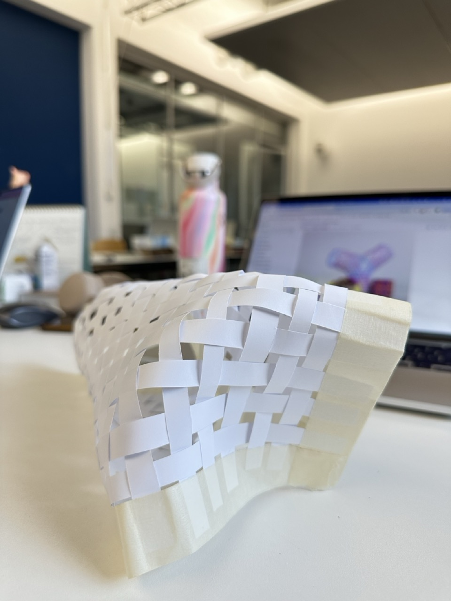
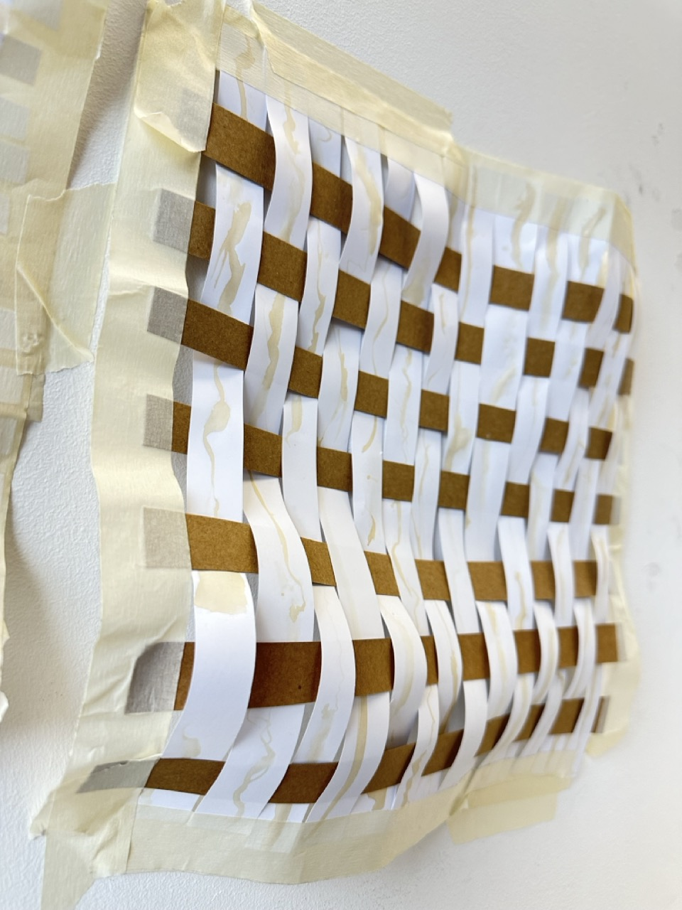
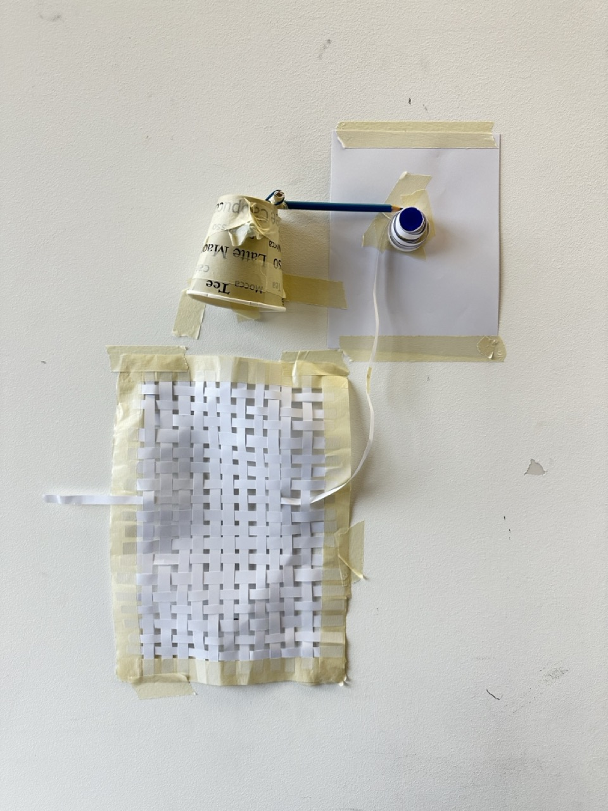
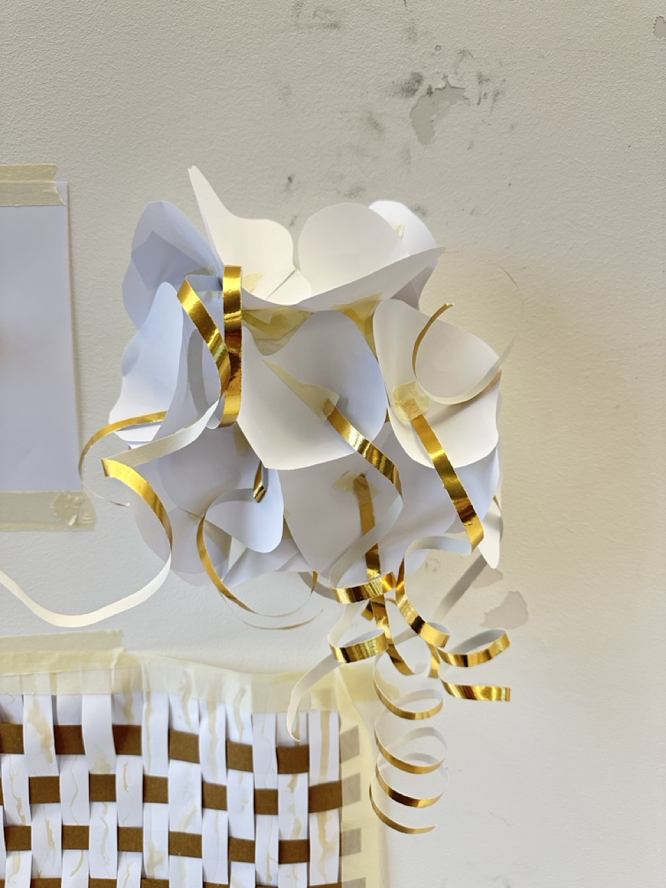

# Tuesday, november 12, 2024

## References 
### Paper projects

[Matthew Gardiner - Oribotics](https://www.matthewgardiner.net/art/Oribotics_de)

[Matthew Gardiner - ORI*Universe Pendant](https://www.matthewgardiner.net/buymystuff/ORIUniverse_Pendant)

[Claire & Lea - Anima I](https://claire-lea.com/projects/anima-i)

[Adrianus Kundert - Experimenting with basketry](https://adrianuskundert.com/3d-weaving/overview)

### Shapes & visual

## Feedback from Laure
- Choose a thematic (welcoming, bringing the people that live in the home together, noticing entries, etc.)
- Too complex to do a collection of robots
- Stay simple : 1 input / 1 or 2 outputs
- Does it really has to be on the door?
- Is it mendatory or not (ex: has to tell a story to enter, or is the story telling itself ?)
- Does the robot hold itself ? Does it hang ? Is it placed on something ?
- Sismographe
- Play with the gestures
- What are the movements ? How ?

-> I will now focus on the idea of a storyteller robot (Baudelaire). I will play with the movements of the paper, what kind of stories does it tell, is it written or not ? Try all of this with paper prototypes directly.

## Storyteller

**Main thematic:** in & out

**Intention:** bringing people who live in the same home together / a conversation starter / paying attention to a very basic action

**Input = something linked with coming in and out of the home**

Passive :

- Sound
- Walk on the carpet
- Opening angle of the door
- How the handle is pressed
- How the door is closed

Active :

- Talking to the robot
- Touching
- Giving a gift

**Output = a story**

With paper : 

- Text
- Drawing
- Confettis
- Coffee stains

Other : 

- Movement
- Color
- Shape

## Paper prototypes

