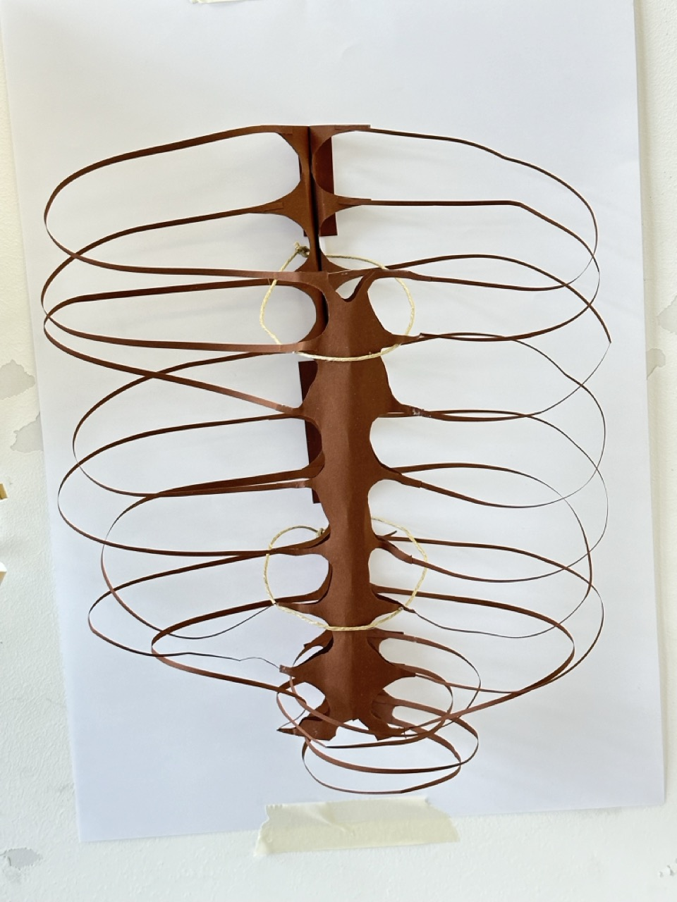
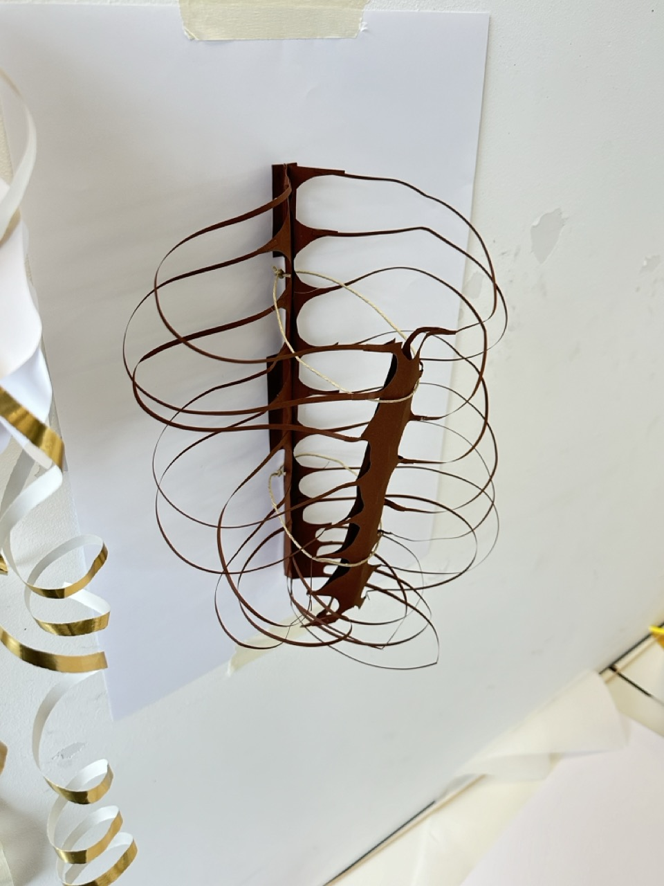
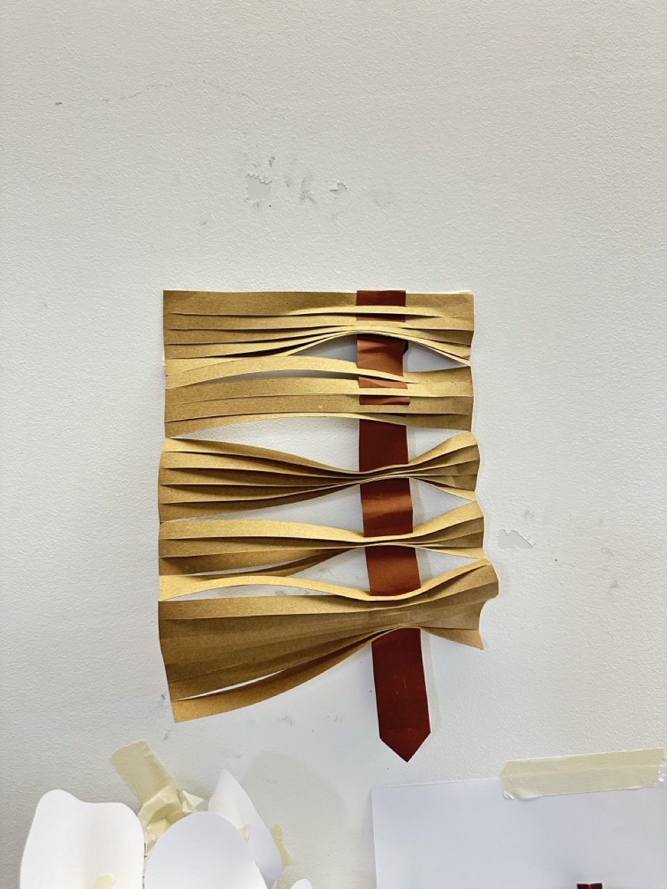
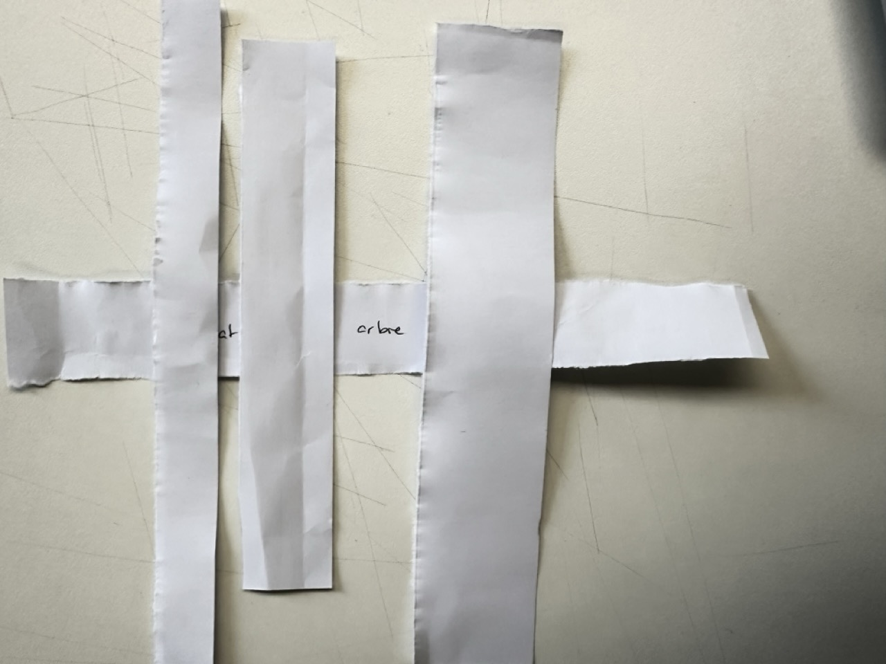
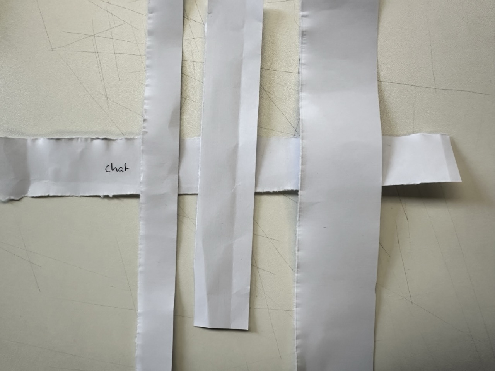
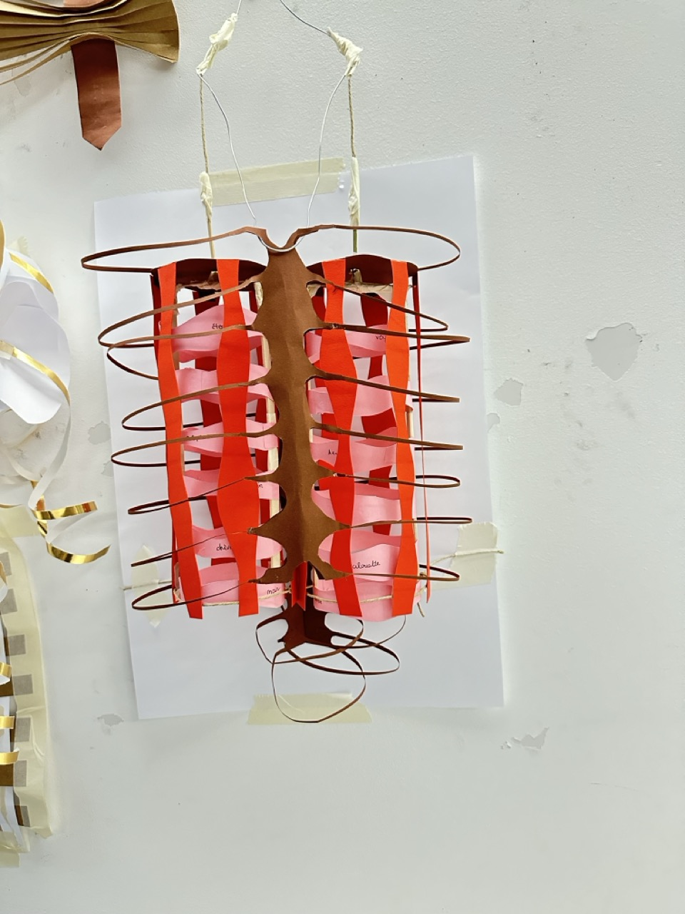
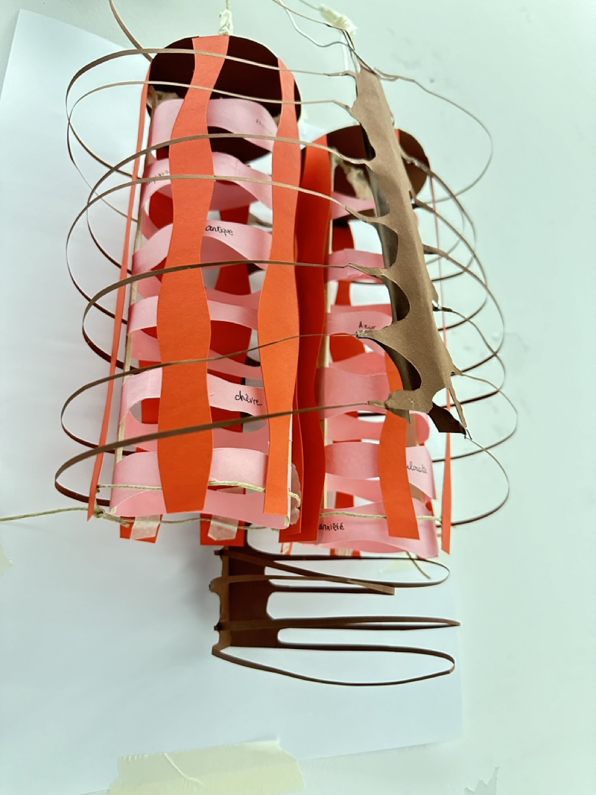

# Wednesday, november 13, 2024

## Paper prototypes

## Story test with ChatGPT-4o

**Question**

Salut, tu es un robot qui raconte des histoires sur les départs et arrivées des habitants d'un appartement. Tu reçois comme informations, l'intensité avec laquelle la poignée de la porte est appuyée. Chaque fin de journée, vers 20h00, tu rends une histoire qui sera ensuite imprimée. 
L'histoire que tu vas raconter chaque jour sera poétique. J'aimerais que chaque jour, tu utilise un différent poème des Fleurs du Mal comme inspiration. Il faut que cette histoire raconte les allés et venus des habitants de la maison de façon non figurative. Je ne veux pas que tu parles de la poignée en tant que telle. Essaie d'être le plus créatif possible pour écrire de belles histoires. Chaque histoire devrait être de moins de 10000 caractères.
Est-ce que tu as compris ? Si oui, je vais t'envoyer un exemple de données (force sur la poignée de la porte) que tu auras collectés durant 1 journée, et je te demanderai d'en faire une histoire.

**DAY 1 Dataset**

| Passage | Temps (s) | Vitesse max (°/s) | Profil de vitesse angulaire (°/s) |
| --- | --- | --- | --- |
| 1 | 1.2 | 250 | [0, 80, 150, 220, 250, 210, 80, 0] |
| 2 | 1.5 | 180 | [0, 60, 120, 160, 180, 140, 60, 0] |
| 3 | 1.0 | 320 | [0, 90, 180, 250, 320, 280, 90, 0] |
| 4 | 1.8 | 160 | [0, 40, 90, 130, 160, 150, 70, 0] |
| 5 | 0.9 | 280 | [0, 100, 180, 250, 280, 260, 90, 0] |
| 6 | 1.3 | 220 | [0, 70, 150, 190, 220, 190, 70, 0] |
| 7 | 1.1 | 300 | [0, 85, 170, 240, 300, 270, 85, 0] |
| 8 | 1.4 | 200 | [0, 60, 130, 180, 200, 170, 60, 0] |

**Story received, based on the poem *Bénédiction* for day 1**

Dans le crépuscule hésitant, la maison devient un cœur battant, un espace de douleurs et de grâces invisibles. Chaque passage ouvre une brèche où se glisse l'éclat furtif d'une âme. Ils défilent, porteurs d'une quête secrète, gravant dans l’air l’élan de leurs doutes et de leurs peurs.

Un premier souffle éclate, tel un poing crispé de 250 murmures aiguisés, et le seuil se gorge d’une ferveur presque désespérée. Puis vient un autre, timide, à peine un soupir, retenu et brisé, comme un écho mélancolique qui s’épuise à chercher la lumière.

Chaque pas marque la lutte d'une âme contre les murs invisibles du quotidien, une danse silencieuse où la douleur transfigure en noblesse. Et là, dans ce ballet de forces, la maison, calme, béatifie ces âmes errantes, offrant le baume de la nuit comme un ange impassible face aux orages du jour.

Ainsi, bénie soit cette demeure, sanctuaire d'un peuple qui ignore la splendeur de ses propres tourments, illuminant sans le savoir la profondeur de leurs traversées secrètes.

**DAY 2 Dataset**

| Passage | Temps (s) | Vitesse max (°/s) | Profil de vitesse angulaire (°/s) |
| --- | --- | --- | --- |
| 1 | 1.2 | 260 | [0, 90, 180, 260, 230, 100, 0] |
| 1 | 1.4 | 220 | [0, 70, 160, 220, 200, 80, 0] |
| 2 | 1.0 | 310 | [0, 100, 200, 310, 280, 110, 0] |
| 2 | 1.2 | 250 | [0, 80, 170, 250, 230, 90, 0] |
| 3 | 1.5 | 200 | [0, 60, 130, 200, 180, 70, 0] |
| 3 | 1.3 | 210 | [0, 75, 150, 210, 190, 80, 0] |
| 4 | 1.1 | 280 | [0, 90, 180, 280, 250, 90, 0] |
| 4 | 1.6 | 190 | [0, 60, 130, 190, 170, 65, 0] |

**Story received, based on the poem *L'albatros* for day 2**

À la nuit tombée, la porte s'ouvre et se referme, lourde de mystères et de souvenirs d’envols. Elle s'agite comme un oiseau noble qui, dans ses élans, s’élève presque au-delà des murs, traînant sa majesté éreintée entre les bois ternis par les mains des passants. À chaque mouvement, elle ploie, rappelée à l'ombre par un poids invisible, comme si elle portait la mémoire d'un ciel trop vaste pour elle seule.

Dans cette danse, elle vacille entre audace et lassitude, s’étirant vers quelque chose d’invisible, une liberté à jamais contenue. Un soupir de métal, une crispation lente la traversent, pareilles aux battements d’ailes d’un albatros pris au piège de ses propres rêves, ses contours fiers, mais troublés par l’usure. Le geste se répète, et sous les mains anonymes, elle s'abandonne à l’élan d’un retour, d’un départ, comme un ancien prince des cieux relégué au sol.

Ainsi, elle demeure, fière mais exilée, porte battante habitée de brumes et de tempêtes, éprise d’un ailleurs, encore.

---

Ajouter un espace sur le robot pour pouvoir poser un livre de poésie ? Et ensuite, les histoires seront basées sur ce livre ?

## I NEED TO SIMPLIFY (for the 100th time)

- Rélévaltion de mots en fonction d'une torsion / différentes couches
- Chaché / affiché
- Une lettre un mot

## Telling a story through words

The robot is a shape of a thorasic cage. 
Inside, there are two cylinders, like lungs.
These lungs are made up of 2 layers of paper strips. One vertical on the outside, one horizontal on the inside. The inner layer is movable, it smiles. On this layer are words. They are displayed or not, depending on the placement of the vertical strips. This is his way of telling a story. 

The words are taken from poems in Baudelaire's Fleurs du Mal. 

## To do tomorrow 
- Try again, with a more solid cage, maybe more regulier
- Try some other types of vertical lines -> mix of white & red bands that are really thin, play with shape
- Try more bands inside with words
- Check for other words from other poets
- 