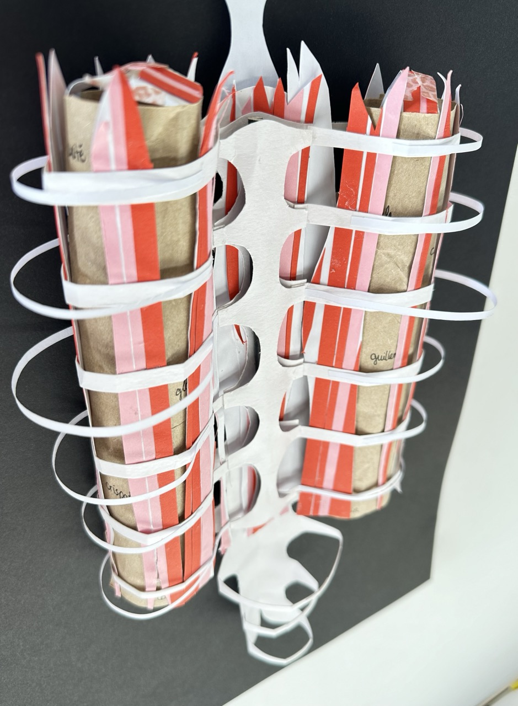

# Thursday, november 14, 2024

## Prototype

## Feedback
- Look at the mecanic
- Tumbler system of locks
- Create password through poems to remember 
- Memory trick 
- Play with different kind of layers 
- Find different ways of hiding / showing words 
- Different mechanics 
- Interactivité passive ok : interinactivité

### References
- Print studio -> poem book with plastic pages 
- [Cent mille milliards de poèmes by Raymond Queneau](https://fr.wikipedia.org/wiki/Cent_mille_milliards_de_po%C3%A8mes)
