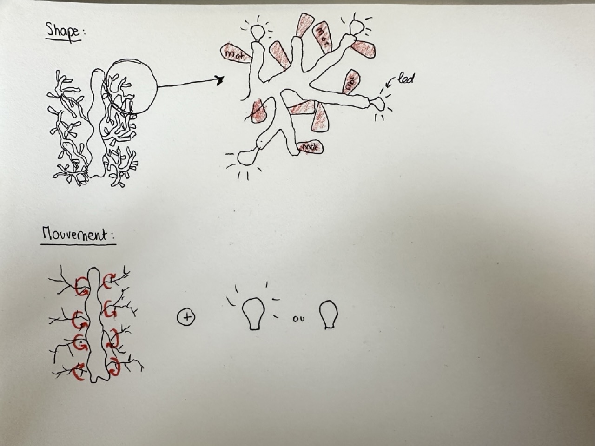
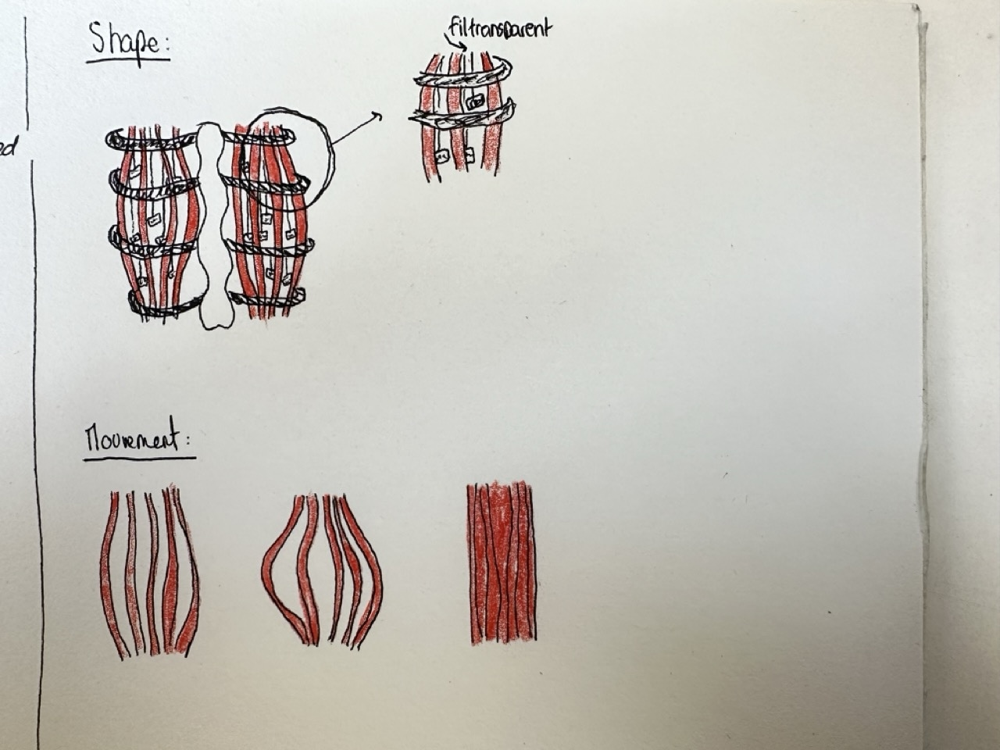
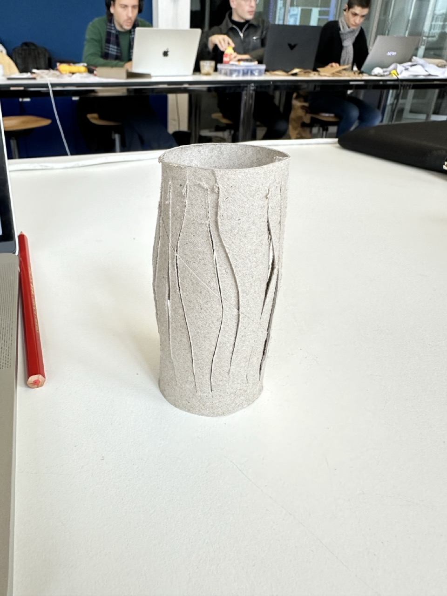
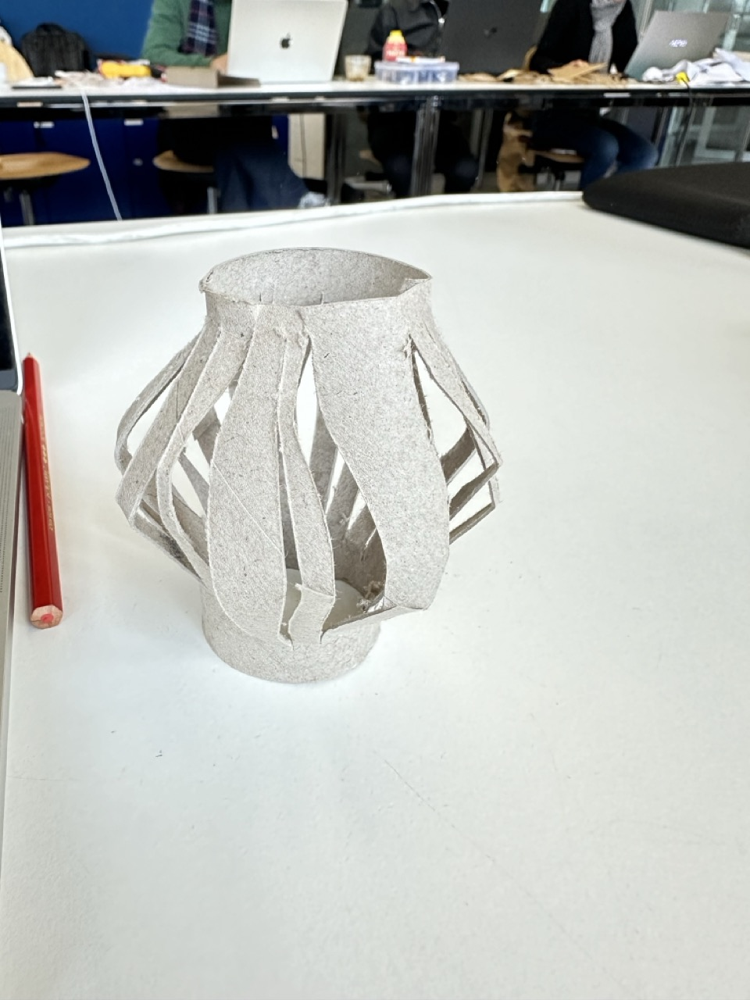
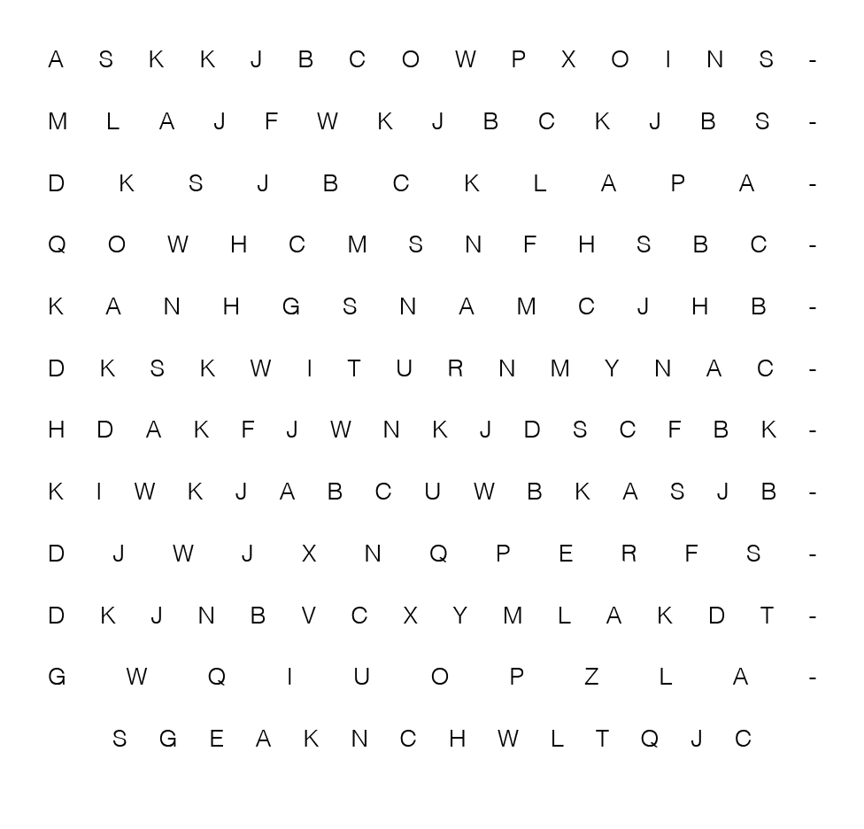
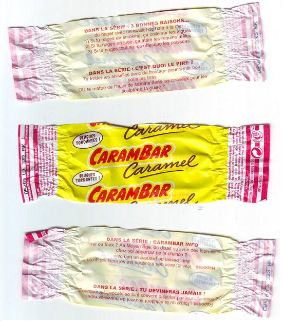
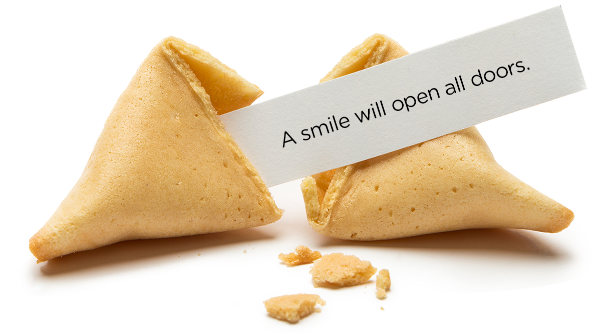
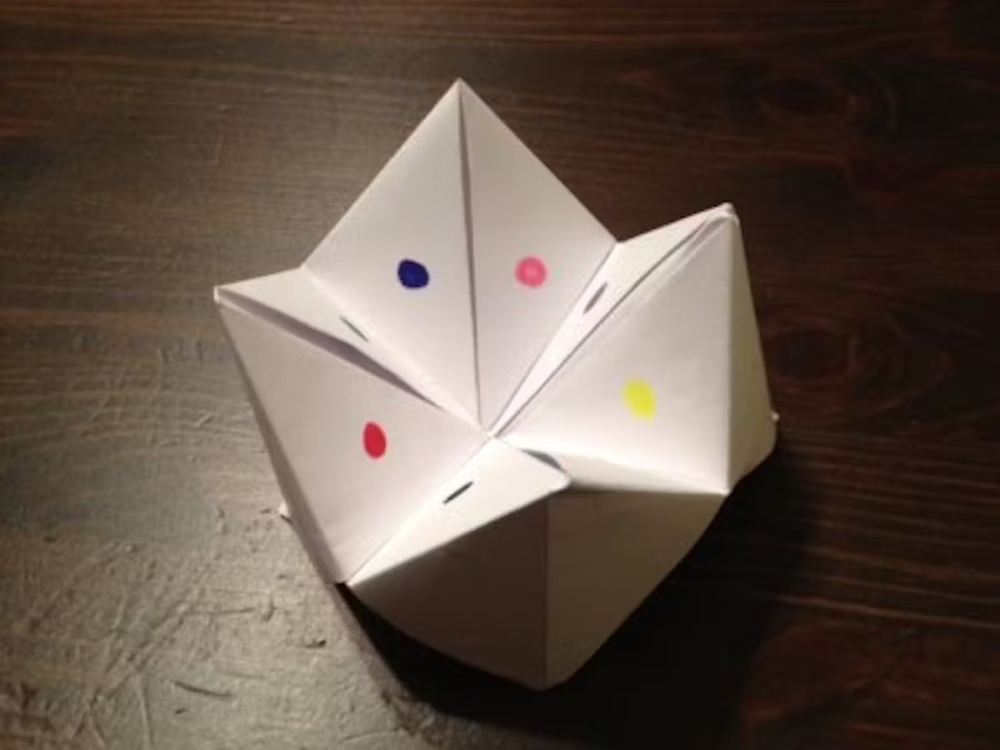
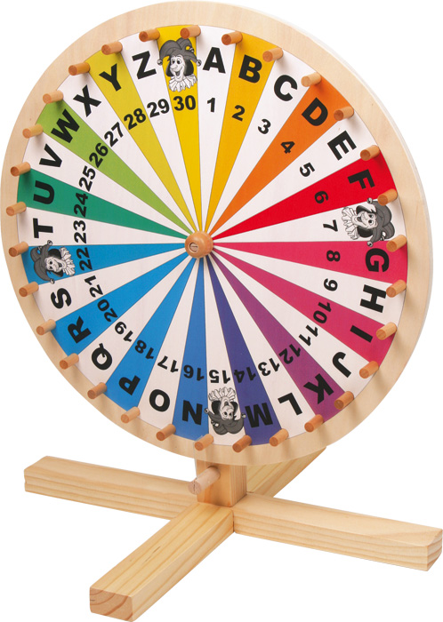
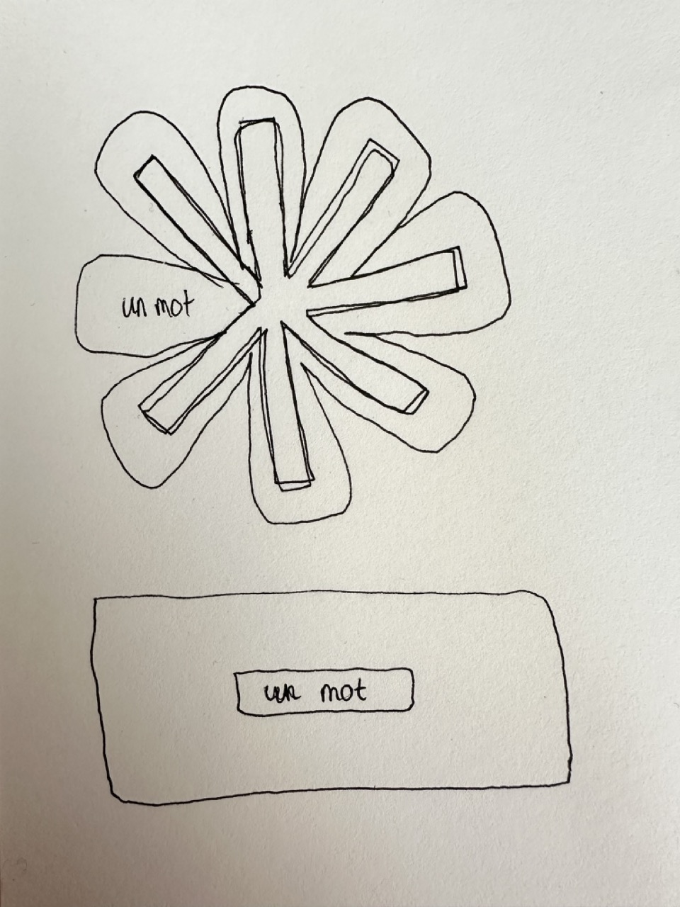

# Wednesday, november 20, 2024

## To Decide
### What is the input?
I’d like the input to be tied to the intention, but I’m struggling to find it.

- Handle?
- Light?
- Door opening?
- Ambiant sound?
- Specific sounds?
- Temperature?

### Type of interaction 
- Reading words?
- Seeing something different each time?
- Taking words? (in this case, the robot is not telling you a story, you're creating one by choosing the papers you take and how many -> more agency)

### Different ways to create poetry
- Words
- Sentences
- Colors
- Movements

### Visual inspirations/forms
- Lungs
- Heart (organ)
- Tree
- Path
- Shoal of fish

### Different ways to display/hide
- Transparent paper or not
- Light/shadow
- Paper in front or not
- Using more than 2 overlapping layers
- Scattered letters joining together to form words
- Accordion/folding and unfolding
- Lock (aligning the right numbers to reveal the password)

### Different movements
- Opening
- Turning
- Expanding
- Rising

## Shape / movement sketches

## Feedbacks
- First define what kind of words I want to show, is it a phrase, is it just words, is it letters?
- How are these letters/words/phrases organized?
- How to display/hide them?
- What is the link between the letters/words/phrases showed and the input?
- Noise that is produced with the door closing could be a good input
- How sustainable in time is the robot? Are the letters/words/phrases going to be repeated?
- Where do a take the letters/words/phrases from?
- What is the reading direction?
- How many letters/words/phrases are displayed at the same time?
- Are these letters/words/phrases classified by adjectives, verbs, names, etc.?
- The Exquisite Corpse game
- Do I use a screen? Maybe with a paper in front to make it look softer?
- Later I can focus on the shape and extention of the moving parts to create an interesting visual piece

## Letters, words, or phrases?

### Trying something with letters

A selection of letters could create a word, readable or not. 
This idea doesn't seem to be a good one since it would be really difficult to link the letters choosed to the way the door was openend. 

### Phrases that describe doors from selling websites
Vous cherchez une porte d'entrée moderne qui se fera remarquer ? Notre modèle de porte d'entrée TIFANA sera parfait pour mettre en valeur votre entrée ! Composé de quatre carrés à l'aspect design, cette porte est à la fois esthétique, résistante et isolante.

La porte d’entrée en PVC 1002 signée Solid Elements offre une protection et une isolation thermique optimales grâce à une serrure à cinq points à tête champignon et un matériau isolant renforcé. Les solides charnières 3D assurent un fonctionnement fluide, tandis que le double joint hautement élastique garantit une isolation supplémentaire. Le verre décoratif protège des regards indiscrets tout en laissant passer la lumière. Dotée d’un noyau en acier galvanisé, d’un joint périphérique et d’un remplissage en sandwich isolant, cette porte d’entrée convient idéalement dans votre maison.

Outre son aspect élégant, cette porte facile d'entretien convainc par une protection améliorée contre la pluie battante ainsi que par son remplissage recouvrant l'extérieur du vantail sans bords de vantail visibles avec parclose intérieure. Les avantages techniques sont l'isolation thermique accrue du remplissage du cadre du vantail ainsi qu'une meilleure protection contre les effractions grâce à la surface lisse jusqu'au dormant.

Avec la porte en aluminium Mexico 1, dites adieu aux sensations de froid, à l'insécurité et bonjour à la tranquillité, la performance énergétique et à des factures allégées. Fini les sensations de froid ! Vous avec une entrée moins froide et un meilleur sommeil.

Porte d'entrée Modèle 35 Dimension 95cm largeur 215cm hauteur 7cm profondeur Couleur marron Type d'ouverture : À gauche Description Cette porte d'entrée garantit une haute sécurité. Elle allie un design élégant à d'excellentes caractéristiques techniques pour nos clients qui recherchent la porte parfaite dans les dimensions 95x 215 cm (L x H). Notre porte d'entrée est dotée d'un cadre et d'un panneau de qualité, de 8 points de verrouillage. Cette porte d'entrée se caractérise par son excellente qualité et son grand confort de verrouillage. Ce produit fournit un kit complet car il comprend la poignée d'ouverture en acier inoxydable, la poignée intérieure, le cylindre profilé, 5 clés.

### Asking ChatGPT 4.0 to classify them by names, verbs, adjectives and lexical field
**Verbes**

**Champ lexical de la porte et de la maison**

- remarquer
- mettre
- protéger
- garantir
- laisser
- assurer
- fonctionner
- offrir
- isoler
- renforcer
- convenir
- convaincre
- allier

**Champ lexical de l'action/technique**

- se faire
- composer
- fournir
- comprendre
- caractériser
- améliorer
- garantir

---

**Noms**

**Champ lexical de la porte et de l'architecture**

- porte
- entrée
- vantail
- dormant
- cadre
- panneau
- charnières
- poignée
- serrure
- cylindre
- clés

**Champ lexical des matériaux et techniques**

- PVC
- aluminium
- acier
- noyau
- joint
- remplissage
- verre
- parclose
- sandwich isolant

**Champ lexical des qualités**

- esthétique
- protection
- isolation
- sécurité
- performance
- confort
- qualité

**Champ lexical de la maison et de l'énergie**

- maison
- lumière
- tranquillité
- facture
- sommeil

---

**Adjectifs**

**Champ lexical des qualités**

- moderne
- esthétique
- résistante
- isolante
- fluide
- élégante
- renforcé
- optimales
- solides
- élastique
- supplémentaire
- recouvrant
- visible
- lisse

**Champ lexical des couleurs et apparences**

- design
- décoratif
- marron

**Champ lexical technique**

- galvanisé
- thermique
- accru
- parfait
- hautement

### Listing poems
THIS last denial of my faith,
Thou, solemn Priest, hast heard;
And, though upon my bed of death,
I call not back a word.
Point not to thy Madonna, Priest,­
Thy sightless saint of stone;
She cannot, from this burning breast,
Wring one repentant moan.

Thou say'st, that when a sinless child,
I duly bent the knee,
...
...
The praises of their god oft sung,
And oft his mercies told.

You see them with their beards of snow,
Their robes of ample form,
Their lives whose peaceful, gentle flow,
Felt seldom passion's storm.

Then a calm, solemn pleasure steals
Into your inmost mind;
A quiet aura your spirit feels,
A softened stillness kind.

### Asking ChatGPT 4.0 to classifiy each verse into a category : past, present, future
**Passé**  
1. "This last denial of my faith, Thou, solemn Priest, hast heard;"  
2. "Thou say'st, that when a sinless child, I duly bent the knee,"  
3. "Long ago I wished to leave 'The house where I was born;'"  
4. "Long ago I used to grieve, My home seemed so forlorn."  
5. "Life and marriage I have known, Things once deemed so bright;"  
6. "Now, their very memory comes O’ercharged with tender tears."  
7. "Though the soul's bright morning rose O'er Paradise for me,"  
8. "To ages when the earth was young, When patriarchs, grey and old,"  
9. "You see them with their beards of snow, Their robes of ample form."

---

**Présent**  
1. "And, though upon my bed of death, I call not back a word."  
2. "She cannot, from this burning breast, Wring one repentant moan."  
3. "Can time, can tears, can distance dim The memory of my lord?"  
4. "Talk not of thy Last Sacrament, Tell not thy beads for me;"  
5. "Both rite and prayer are vainly spent, As dews upon the sea."  
6. "There's no use in weeping, Though we are condemned to part:"  
7. "There's such a thing as dwelling On the thought ourselves have nursed,"  
8. "Bear a cheerful spirit still; Never doubt that Fate is keeping Future good for present ill!"  
9. "True pleasure breathes not city air, Nor in Art's temples dwells,"  
10. "Go where the woods in beauty sleep Bathed in pale Luna's light,"  

---

**Futur**  
1. "And where none shall dare restrain us We can meet again, in thought."  
2. "Future good for present ill!"  
3. "Then will the bliss of Heaven be won; Then will Hell shrink away,"  
4. "Farewell, dark and rolling deep! Farewell, foreign shore!"  
5. "Open, in unclouded sweep, Thou glorious realm before!"  
6. "As you gaze on this vast scene Your thoughts will journey far,"  
7. "Though hundred years should roll between On Time's swift-passing car."  
8. "The sun which golden light doth shed, The clouds of pearly hue."  
9. "Then a calm, solemn pleasure steals Into your inmost mind."

### Asking ChatGPT 4.0 to sort each verse from each category from its intensity level
**Past**
1. **"This last denial of my faith, Thou, solemn Priest, hast heard;"**  
   _(Une déclaration intense et grave, centrée sur une rupture définitive avec la foi.)_

2. **"Thou say'st, that when a sinless child, I duly bent the knee,"**  
   _(Un rappel poignant de l'innocence perdue, empreint de regret et de mémoire.)_

3. **"Though the soul's bright morning rose O’er Paradise for me,"**  
   _(Une image puissamment contrastée, où l'espoir initial rencontre une mélancolie sous-jacente.)_

4. **"Life and marriage I have known, Things once deemed so bright;"**  
   _(Un ton nostalgique, mêlant un passé lumineux à une vision plus sombre.)_

5. **"Now, their very memory comes O’ercharged with tender tears."**  
   _(Une émotion douce mais profonde, où le souvenir évoque des larmes empreintes de tendresse.)_

6. **"Long ago I wished to leave 'The house where I was born;'"**  
   _(Un désir intense de départ, chargé d'un besoin de liberté et de changement.)_

7. **"Long ago I used to grieve, My home seemed so forlorn."**  
   _(Une douleur ancienne, exprimée avec une tristesse plus apaisée.)_

8. **"To ages when the earth was young, When patriarchs, grey and old,"**  
   _(Une réflexion douce et imagée sur des temps anciens, presque mythiques.)_

9. **"You see them with their beards of snow, Their robes of ample form."**  
   _(Une description visuelle apaisante et contemplative, pleine de respect et de sérénité.)_

---

**Present** 

1. **"And, though upon my bed of death, I call not back a word."**  
   _(Une déclaration d'une intensité extrême, mêlant la mort et une fermeté inébranlable.)_

2. **"She cannot, from this burning breast, Wring one repentant moan."**  
   _(Une image saisissante de passion et de défi, chargée d'émotions brûlantes.)_

3. **"Talk not of thy Last Sacrament, Tell not thy beads for me;"**  
   _(Un rejet provocateur des rites religieux, empreint de rébellion.)_

4. **"Both rite and prayer are vainly spent, As dews upon the sea."**  
   _(Un ton fataliste mais poétique, évoquant l'impuissance des gestes humains.)_

5. **"Can time, can tears, can distance dim The memory of my lord?"**  
   _(Un sentiment puissant d'amour et de fidélité inébranlables face à l'épreuve du temps.)_

6. **"There's no use in weeping, Though we are condemned to part:"**  
   _(Un mélange de tristesse et de résilience face à une séparation inévitable.)_

7. **"There's such a thing as dwelling On the thought ourselves have nursed,"**  
   _(Une réflexion introspective, plus apaisée, sur le pouvoir des pensées nourries par l'esprit.)_

8. **"Bear a cheerful spirit still; Never doubt that Fate is keeping Future good for present ill!"**  
   _(Un appel encourageant à garder espoir et optimisme malgré les épreuves.)_

9. **"True pleasure breathes not city air, Nor in Art's temples dwells,"**  
   _(Une contemplation douce de la vraie joie, trouvée en dehors des artifices humains.)_

10. **"Go where the woods in beauty sleep Bathed in pale Luna's light,"**  
   _(Un tableau calme et enchanteur, évoquant une paix naturelle sous la lumière de la lune.)_

---

**Future**  
1. **"Then will the bliss of Heaven be won; Then will Hell shrink away,"**  
   _(Intense par la juxtaposition du paradis et de l'enfer, et l'idée d'une lutte cosmique.)_

2. **"Farewell, dark and rolling deep! Farewell, foreign shore!"**  
   _(Intensité de l'adieu mélancolique aux éléments naturels.)_

3. **"And where none shall dare restrain us We can meet again, in thought."**  
   _(Une aspiration passionnée à la liberté et à la réunion.)_

4. **"Future good for present ill!"**  
   _(Une déclaration concise mais puissante sur l'espoir face à l'adversité.)_

5. **"Open, in unclouded sweep, Thou glorious realm before!"**  
   _(Un appel fort et visuel à une vision exaltante et libératrice.)_

6. **"As you gaze on this vast scene Your thoughts will journey far,"**  
   _(L'idée d'immensité et d'introspection ajoute une profondeur contemplative.)_

7. **"Though hundred years should roll between On Time's swift-passing car."**  
   _(Un ton méditatif, mais plus posé, évoquant le passage du temps.)_

8. **"The sun which golden light doth shed, The clouds of pearly hue."**  
   _(Une scène visuellement douce et lumineuse, avec une sérénité naturelle.)_

9. **"Then a calm, solemn pleasure steals Into your inmost mind."**  
   _(Une conclusion empreinte de douceur et de sérénité intérieure.)_

-> 3 rouleaux avec chacun 9 vers = 729 possiblité de combinaisons différentes

## Word/Phrase types & classification
Searching for oppositions to create a scale corresponding to the sound level of the door closing.

- Soft - hard
- Calm - noisy
- Abstract - Concrete  
- Fast - Slow  
- Bright - Dark  
- Stable - Unstable  
- Simple - Complex  
- Positive - Negative  
- Open - Closed  
- Harmonious - Dissonant  
- Active - Passive  
- Natural - Artificial  
- Heavy - Light  
- Strong - Weak  
- Shiny - Dull  
- Near - Far  
- Ancient - Modern  
- Ephemeral - Durable  
- Fun - Serious

## Inspirations

## Questions WITH ANSWERS!
### Basics
***What is the role of my soft robot?***

My soft robot is a conversation starter. It's role is to bring people that live in the same home together. It refers to the french expression : "Mettre sur la table". 

It's role is to motivate people to talk more about specific subject, rather than the weather outside. 

***Where is it placed?***

The soft robot is going to be place next to the front door, on the wall, inside of the home. If possible, it would be visible when you close the door.

***How does it work?***

The soft robot will be reacting to the door being closed. It will then actionnate a motor that will make something turn, that will show a few words. 

Words are choosen, not phrases, because it is easier to remember and it leaves space for the person reading them to interpret them with the context they are in.

The main role of the robot is for when the people arrive home. They would receive a few words to think about and speak about. 

The side role of the robot, is that when you leave home, words will also be picked. This means that you kind of leave words to people staying inside of the home. 

### More specific

***Are the words selected based on the sound that is created by the door closing, and linked to the intensity of movement, is it totally random, or is it a mix between intensity and randomness?***

The randomness makes it a bit more unintentional, which to me feels more interesting than something that is linked to the way the door was closed. Because if it is factually linked to the door sound when closing, I assume users will try to understand why this word came, linked to how they closed the door, and not really think about the words themselves. Also, taking the intensity of the door closing for selecting a word would mean that I have to assume why people closed the door quietly or intensly, which is not really possible and it doesn't leave space for all possibilities. 

But I also like the fact that the words are coming from something factual that the person did. 

So I would prefer my robot to be reacting to the intensity, but keeping a link with the intensity. But the intensity of the door closing would be represented in the movement of the robot, not the words choosed. 

Like the wheel of fortune, the words are selected with the intensity, but the word itself doesn't have a link with the intensity. It would work like the wheel of fortune, but all the words are hidden except the one selected. 

***Is the robot showing the same amout of words everytime or is it random?***

I think it would be better to show the same amout everytime, to not be integrating another random aspect. 

Or there could be one wheel that would be actionnated only if the door was closed calmly. This would be to encourage people to close it quietly to be able to access it. 

Another idea would be that we have 1 word for yourself, one word for you and the people living in the home, and one for the world. You choose which one corresponds to what.

***What kind of discussions I want to robot to create? Is it about feelings, the day that passed, something more creative, something humoristic??***

To help me answer that difficult question, I reached out to my parents and asked them what kind of discussions they would want to be starting more often at home. 

Here is a summary of the answers I received from them :

It would be nice to have more deep conversations, more real and personal, could be around feelings and emotions. 
But also, it would be nice to have some lightness and fun. 
It is also important that everyone have their place and the space to express themselves.

---

Now, is it possible to have words that can evoque deep conversations and some light fun ones too???

***Linked with the question above, what are the words I want to show? Are they a mix of verbs, names and adjectives? Or only one category?***

***Are the words separed into different categories depending on their meaning or feeling?***

***Where do I find the words? How do I choose them?*** 

***How can I represent an organic shape with these wheels?***