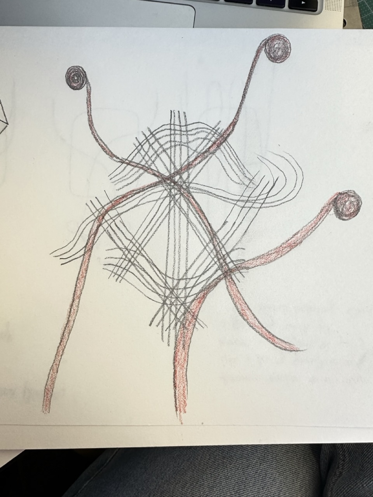
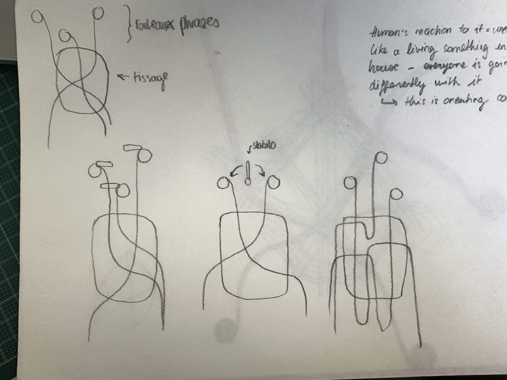
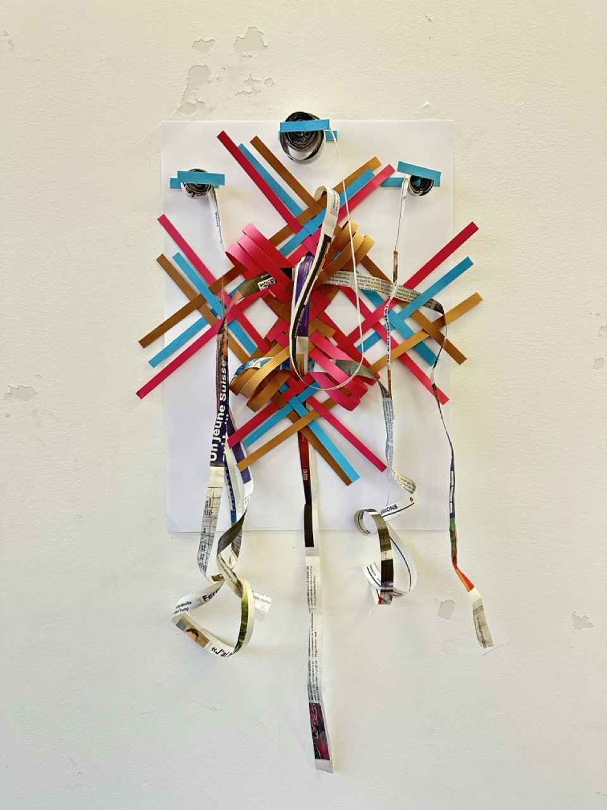

# Thursday, november 21, 2024

## Feedback
Back to the woven paper and texts on strips.

- Trying 3D weaving
- Adding 1 or 2 other paper rolls with texts
- Nick Cave costumes
- Need to do drawings, scenario, prototype

## Back to the questions
***What is the role of my soft robot?***

***Where is it placed?***

The soft robot is going to be place next to the front door, on the wall, inside of the home. If possible, it would be visible when you close the door.

***How does it work?***

***What is the link between the movement of the robot and the noise the door does when closing?***

***What are the different scenarios?***

***Where is the text coming from?***

I could cut strips from newspapers, or print texts from a book. 

***How to do a 3D shape with weaving?***

***Are the paper rolls and stabilos visible or hidden?***

## Sketches & prototype

## Feedback

- Put the rolls in the tructure
- Let the paper strips form part of the weave
- Multiply the structure several times to create more volume
