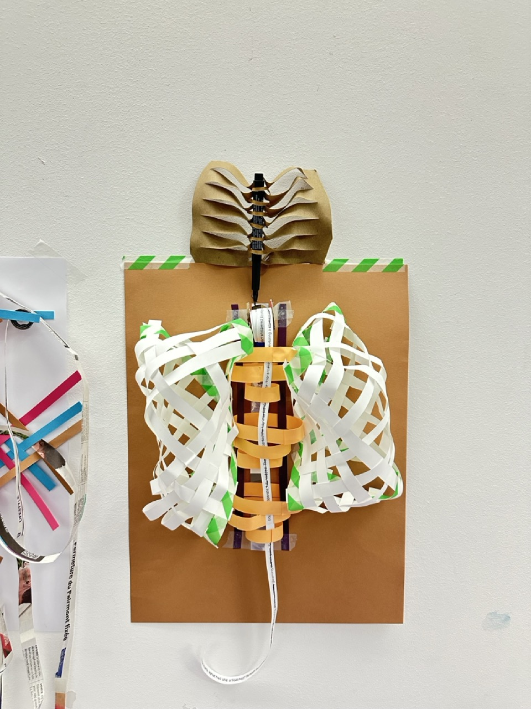
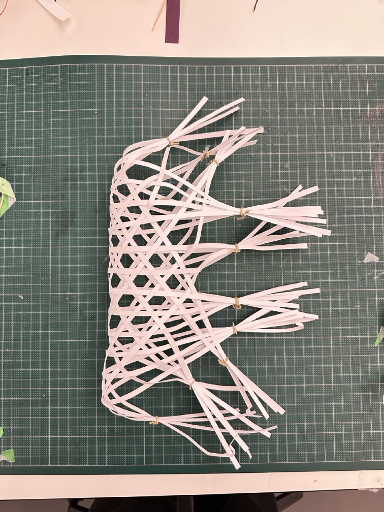
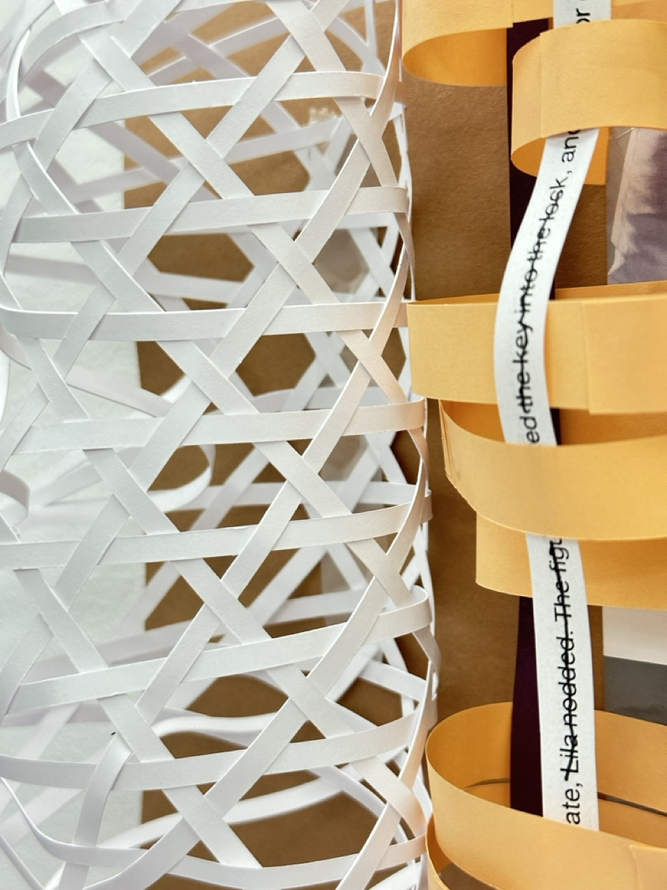

# Week of november 25 to 30, 2024

## Arduino tests

***Capteur de vibration, fait tourner le servo moteur***

***Capteur de lumière, bonhomme fait coucou***

## Inspirations from Ecal

## What is left to do/decide?

## Prototypes
### N°1
- Text strip rewound on other side
- Single roll
- Thin strips
- Irregular weave

---
### N°2
- Weave-in text strip
- Band falls
- Some words/phrases traced with pen
- Thoracic cage
- Medium bands
- Regular weave

---
### N°3
- Version n°2 but better
- Rigid paper
- Beehive weaving pattern
- Thinner paper strips

## What came up while doing the protoypes
- One roller is better
- It's better when it comes down from above
- Tracing words works well
- Why not integrate the possibility of changing the pen for a sabilo. That way, you can choose whether to highlight words or trace them.

### To do 
---

***ARDUINO***
- Test Adruino with door for vibration sensor
- Buy a 9[V] battery

***PAPER PROTOTYPES***
- See what paper I can buy and where
- Test other ways to display the pen
- Test mixes of colors to choose 

***PAPER CUTTING***
- Count the number of paper strips needed
- Mesure the lenght and width of the paper strips
- Create the file in illustrator
- Test with the Zund

***3D MODDELING***
- Sketch how the electronics are going to be displayed
- Do the electronics in Fusion
- Draw the paper part and add texture
- Do the paper roll holder for 3D print

***CONCEPT***
- Decide what kind of text are on the strips
- Talk to Coqs Urbain for the contact of the Brazilian Poet

***PAPER ROLL WITH TEXT***
- Assemble the text for printing
- Cut the strips with the Zund machine
- Assemble with glue to create a roll

## Soldery exercise

## Arduino logic

If sensor detects something (vibration or sound), it will keep the intensity, and make the motor turn for a time that depends on that intensity. 

While the motor is turning, the servo motor is going down and up. 

Example for the servo motor : 

If the intensity is high -> -- ____ -- _______ --- ___ --- _____

If the intensity is low -> ----- __ ------ __

## FAIL n°1
The sensor buzzer is not getting the vibrations of the door closing.

Even when the buzzer is positionned on the door directly, it doesn't get logical data. Sometimes the vibrations are high, sometimes very low, but with no logic.

To solve that problem, Pierre suggested that I use another sensor, which detects when the door is open or closed. 

I will test an arduino code with a button. The robot will react to the door opening, and its behaviour will depend on the time the door was opened.

## FAIL n°2
The DC motor in the Arduino kit is rotating too fast for the paper rolls. Even with the PWM programm to slow it down.

-> a stepper motor has been ordered online 
