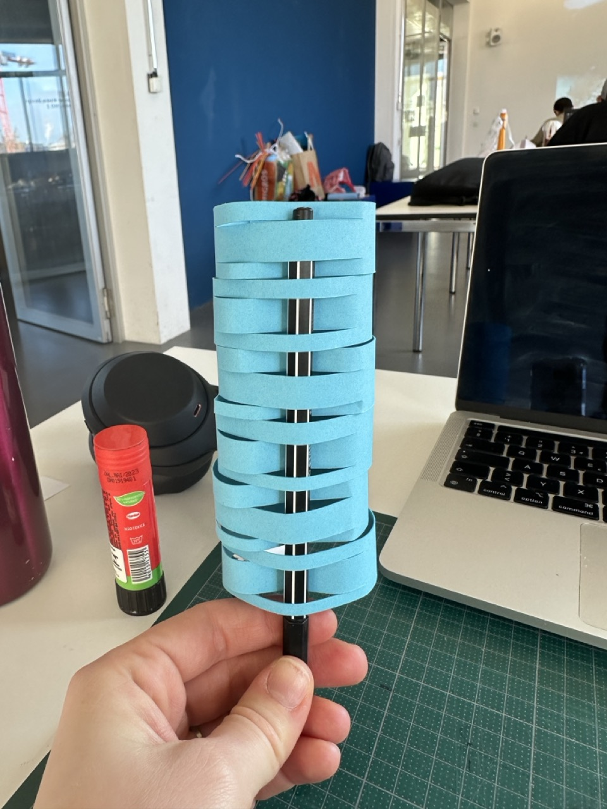

# Thursday, december 05, 2024

## Exploring different ways of holding the pen

## Feedbacks from yesterday
- Divination
- Fautes d’orthographes
- Jokes
- For the day
- Let space for interpretation
- Time
- Abstract 
- Something that you cannot predict
- That surprises you everyday

### General
- External and internal sensorialities
- Inner sensations 

- One more object in our daily life
- Good balance between input output
- Environment impact, emotional impact
- Ressources and impact

- Connectivity between soft robots
- Do more with less
- Do better with less

- Interaction with materials that already exist
- Create a robot with materials that already exist
- Artefacts that are already there

- Why soft robots are interesting
- Difficult to master
- Opens up a lot of possibilities of interactions
- Not close the interactions 
- Instead of finding a grammar that’s perfect
- Opening it up for uncertainty 
- Experimental device to experiment with people
- Be sensible to the infinite possibilities that this object could open
- Object that learns out of the interactions that it has with people -> soft behavior 
- Not so deterministic systems
- Think of programming more like music

- Go away from the deterministic reactions like happiness, sadness, …
- Open object

## Electronic Writing
Writing code to get a text with mixed words coming from libraries.

- Python
- Jupyter Notebook
- Add a text file as a library / write it in the code / get it from python libraries
- Split the text when there is a dot or a virgule

## Different possibilities

How to define a character to the robot while still leaving the intention vague and let the user feel whatever they will feel?
-> The intention is just to create a reaction of unexpected to the user, to surprise them and leave space for personal interpretation.

### Poetic - Abstract
Text : ?

### Absurd - Fun
Text : Words that may be perceived as “funny” because of their meaning or sound. 

### Welcoming - Charming
Text : ?

### Anxious - Ambigu
Text : ?

### Agressive - Guilt-ridden
Text : ?

### Ego booster
Text : ?

### Full random
Text : Newspaper

### Letter in the wrong order
Text : Each word has 2 letters switched

## Possibilités pour créer un texte
- Trouver des textes qui sont de base connotés avec une certaine émotion
- Faire un choix de mots et générer des textes avec du code.
- Choisir un texte de base, puis le transformer en séparant les phrases et les mettant dans un ordre différent
- Choisir un texte de base, puis changer les mots

## Feedback n°2
- Créer un objet lié avec le même type de tissage partout (pas plusieurs séparés et différents)
- Intégrer la bande de texte dans le tissage comme partie intégrale du tissage -> forme avec nids d'abeille mais dans l'autre sens (pour avoir des bandes verticales)
- Attention avec les couleurs et pas qu'il y ait trop d'informations
- Un rouleau en haut centré c'est good
- Choisir le texte + le fait que ca vienne de qq un d'autre bof
- Zund ok pour tout mettre à côté et pas besoin de marges
- Ajouter du texte (le même que sur le rouleau), sur les bandes pour le tissage ??
- Attention, il faut qu'il y ait un mécanisme pour enlever et remettre le rouleau + penser à comment on le change, comment ca se suit, est-ce que le rouleau arrête de tourner s'il y a plus de papier?
- Il faut décider du socle (tenir tissage) et comment cacher l'elec -> mettre une plaque en bois comme sorte de cadre (comme sur les horloges) -> dessiner sur Fusion
- Bien définir en termes de code ce qu'il se passe quand la porte ouvre et comment les traits sont faits par le stylo -> pas anticipable, changer les paramètres ? , ou prévisible...
- Tenir le stylo pas avec un truc en bois ou autre pas papier?
- Le stylo est-il fixe (et donc choisi) ou l'utilisateur peut-il choisir ce qu'il met comme stylo ?
- S'il y a des noeuds il faut choisir leur forme et le fil

NEXT STEPS : 
- Tests générer du texte et isoler des mots/phrases -> définir ce texte
- Modéliser le cadre en bois sur Fusion
- Faire des tests de découpe papier avec différents types de papiers
- Définir les couleurs, apparence, etc.
- Refaire des tests de tissages à partir des existants
- Définir la typo, couleur et la taille du texte
  