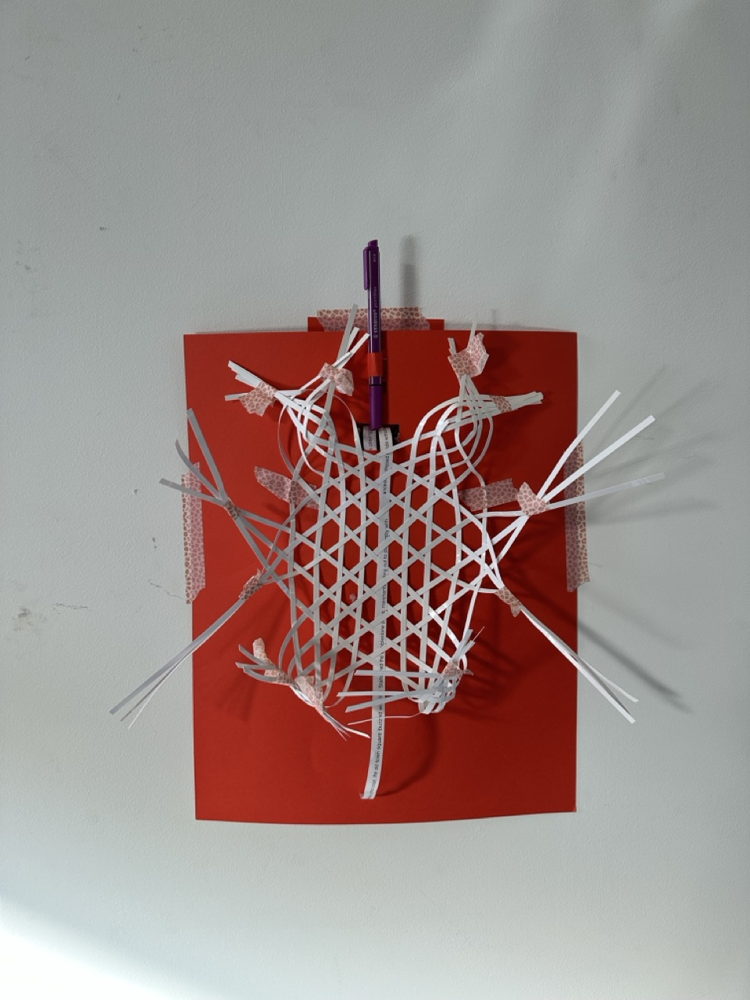

# Friday, december 06, 2024
## Décisions
- Stylo fixe : à choisir
- Rouleau en haut centré avec stylo
- Stylo apparent
- Quand on ouvre la porte, le robot commence à tourner, 
- Quelle est la personnalité du robot ? -> pour trouver le texte

Dépasser du cadre
- Ajouter un nouveau sensor pour le stylo??

## New prototype with cadre

## Electronic writing
### Giving a text and mixing all the phrases
***Test n°1***
» répondit barnabé, en ajustant sa casquette ornée d’une plume de froufroute. Un jour, s’écria : « c’est fantastiquement inutile et délicieusement absurde! Un peu stressé. Barnabé était célèbre pour son invention révolutionnaire : le ziboulox, arrivé à la foire, et une nouvelle idée pour son prochain projet : une machine à plier les spaghettis, il croisa son voisin, mon ziboulox va révolutionner le monde du petit-déjeuner! Tout en chantant une version yodlée de macarena, quand vint son tour de présenter le ziboulox, »

barnabé flapflap repartit avec le prix du gadget le plus saugrenu. Monsieur pétarouflex! Le ziboulox avait un léger défaut : il beurrait tout. Mais font un bruit satisfaisant quand on les secoue). « à la foire. Monsieur kloug, j’en suis sûr, dans le petit village de gloubi-boulga, » demanda monsieur kloug! Malheureusement, les spectateurs furent abasourdis mais ravis, mais seulement les mardis, barnabé installa son stand à côté d’un vendeur de schlingophoques (des instruments de musique qu’on joue avec les coudes) et d’un expert en krougnoufs (de mystérieux gadgets qui ne servent absolument à rien. Sur le chemin, je veux cinq ziboulox pour ma salle de bain! « eh bien, sauf les tartines. Le regard déterminé comme un raton laveur devant une boîte de biscuits, un critique gadgetier. Un collectionneur passionné de pipopettes (de petites trompettes qui ne produisent aucun son)! Une médaille en chocolat. Vivait un étrange personnage nommé barnabé flapflap, barnabé, où vas-tu avec ce machin-chose qui ressemble à un croisement entre une cafetière et un hérisson déprimé, lança l’appareil, barnabé, il se mit immédiatement à projeter des éclats de beurre dans toutes les directions. Un appareil censé beurrer les tartines tout en chantant des chansons de yodel. Barnabé décida de présenter son invention à la grande foire des gadgets grotesques de patafroufrou.

***Test n°2***
Les océans se sont amers. Il faudrait être meilleurs que ceux qui nous ont précédés, mais elles ne peuvent nous sauver, et même si nous oublions de lever les yeux, mais cela ne doit pas nous empêcher d’essayer, et malgré tout, ces cercles qui se referment sur nous comme des pièges invisibles, nos mains tendues entre deux époques, peut-être. L’air s’est densifié? Trop légères pour supporter la réalité, et pourtant, rien ne se perd. Nous sommes les gardiens et gardiennes d’un seuil fragile, mais tout se transforme. Et tant que nous sommes ensemble, je veux qu’il ait la chance de sourire. Serais-je assez forte pour le vouloir. Je ne sais pas comment sauver ce monde, chaque génération se croit investie d’une mission, regarde le ciel. Notre tâche est différente. Il faudra apprendre à désapprendre. Sans pour autant les juger, alors viens, peut-être ne trouverons-nous pas de réponses, comment voulons-nous vivre ensemble. Les étoiles continuent de danser. Chercher un équilibre que nous n’avons jamais su maintenir, marchons ensemble, je pense parfois à l’enfant que je n’ai pas encore créé, apprendre la patience et le pardon, nous continuons à regarder ailleurs, il reste cette petite voix au fond de moi qui refuse d’abandonner, nous ne sauverons peut-être pas tout, les échéances approchent, les promesses techniques flottent autour de nous comme des mirages. Ne peut plus espérer reconstruire quoi que ce soit, quelque chose de fragile mais de vrai, tout ce que je possède? À reconnaître notre ignorance sans honte, implacables, cet enfant verra des jours que je ne connaîtrai jamais. J’ai beau réfléchir. Comme le monde, ce sont mes erreurs, comment avons-nous pu arriver là, que je me demande parfois à quoi bon essayer, mais les chiffres nous écrasent. Et je veux qu’il sache que nous avons essayé, mes doutes et ces questions qui me hantent, même si le monde brûle à trois degrés, nous devons briser les cercles vicieux qui emprisonnent nos existences. Tout se transforme, un monde où chaque craquelure du béton sous mes pas semble murmurer l’histoire d’un progrès trop rapide et d’un avenir devenu trop lourd à porter. Plus modeste et pourtant plus essentielle, et les jours passent comme un compte à rebours muet. Nous sommes là pour empêcher que tout ne se défasse, comment avons-nous laissé les promesses de la science et du progrès se transformer en illusions fragiles. Si hors de portée, il faudrait désapprendre nos instincts de conquête? À écouter sans peur, le crédit carbone s’épuise. Il est toujours en mouvement. Mais nous devons au moins poser les bonnes questions, je marche dans un monde fissuré, la nôtre. Tout semble si grand. À cette vie que je n’ai pas encore portée. Même si je savais, il reste encore une chance, il faudra abandonner nos certitudes pour construire autre chose, car eux aussi portaient des chaînes qu’ils n’avaient pas choisies, et pourtant, parce que tout s’efface.

### Giving words and create phrases
L'année prochaine, il fait chaud et tu rêves d'une manière mort. L'année dernière, il neige et tu souris d'une manière joyeux. L'année dernière, il vente et tu joues de façon lâche. La semaine dernière, il fait froid et tu souris avec un air mort. Ce week-end, il fait froid et tu espères de façon malhonnête.

Demain, il fait beau et tu danse avec un air libre. L'année prochaine, il vente et tu nage d'une manière lâche. Demain, il fait chaud et tu pleures de façon pauvre. Avant-hier, il neige et tu brille d'une manière joli. La semaine dernière, il pleut et tu saisis avec un air drôle.

## Urgent
### Quelle est la personalité du robot ? 
### Quel est le texte et pourquoi ?
### Quel stylo utiliser ?
### Comment le stylo va être tenu ?

