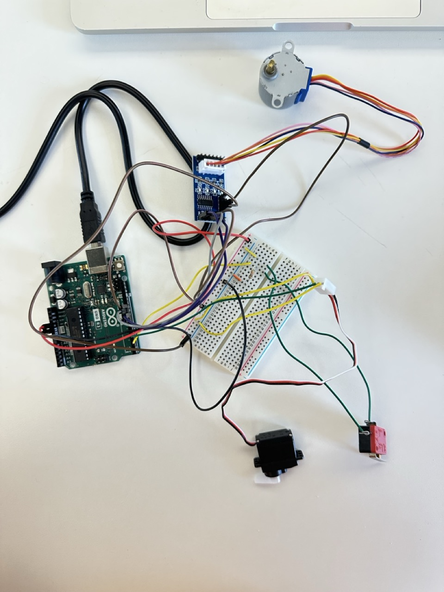
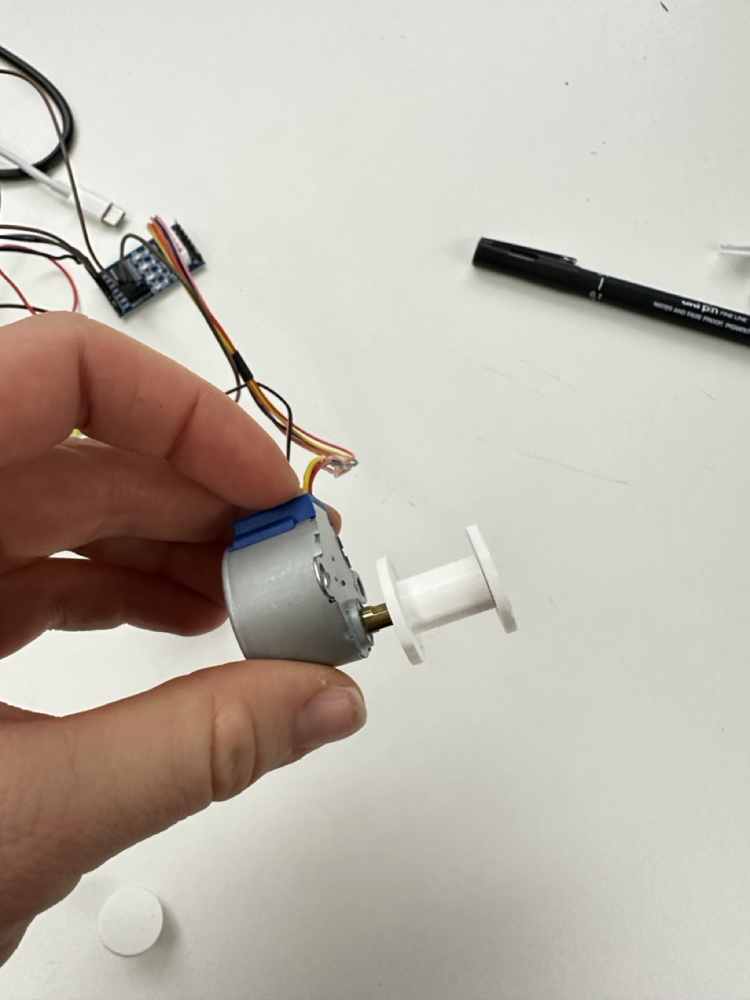

# Monday, december 09, 2024

## Arduino 
It's working !

## Fusion 
### What to do 
- Cadre (bois)
- Outil qui va tenir le stylo (3D print?)
- Cylindre qui va tenir le rouleau de papier -> qui va être tourné par le moteur
- Boîtes pour électronique
- Addon pour l'interupteur pour capter la porte
- Boîte pour l'interupteur à caler sur la porte

### First test for the paper holder

