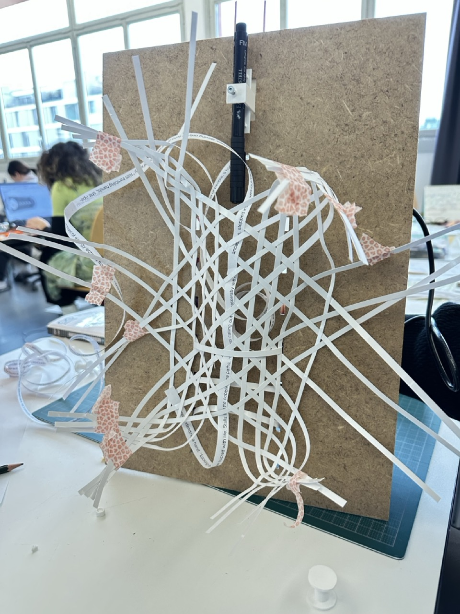
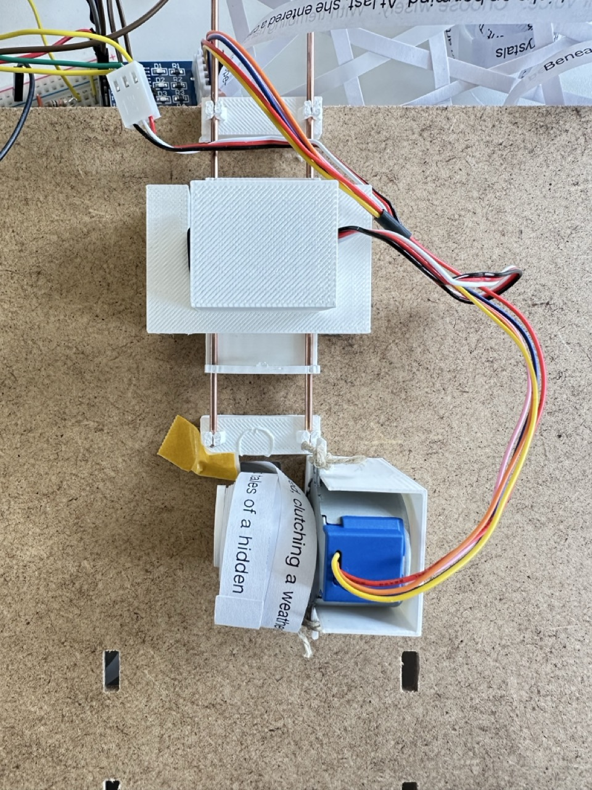
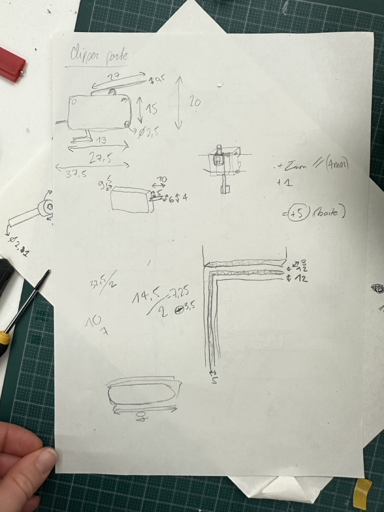
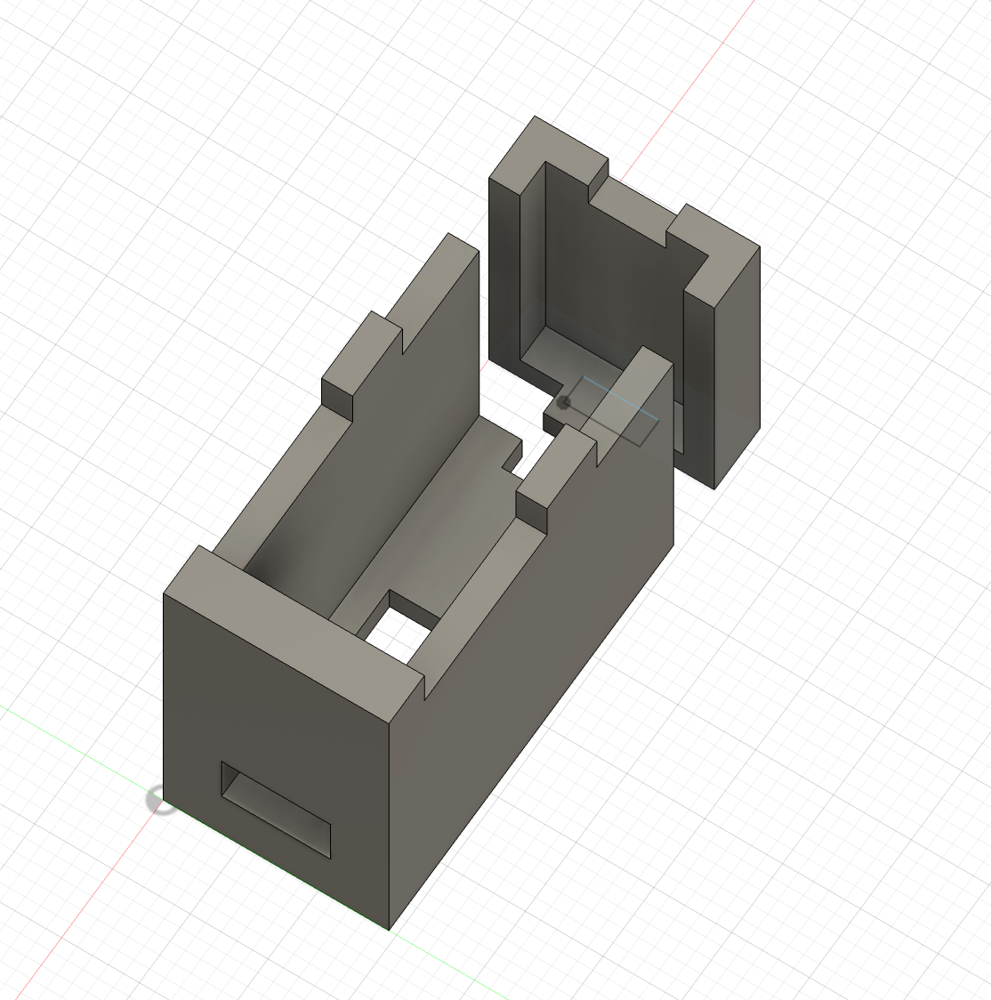
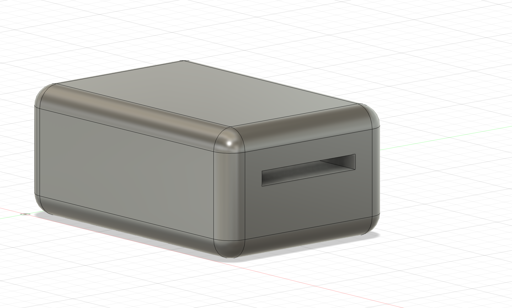

# Wednesday, december 11, 2024
## MDF cutting with the Zund for the frame

## 3D printing 

## Discussion about the shape and the necessity of having a paper form under the mecanism
- Try different things during test day and see how people react to different shapes
- The weaving could be done by the user
- Need a plateform to welcome the paper on the other side of the frame (because the paper is not going through the frame right now..)
- 

## Modeling the box for the door

