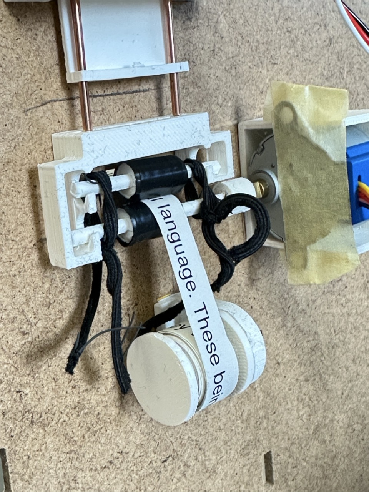
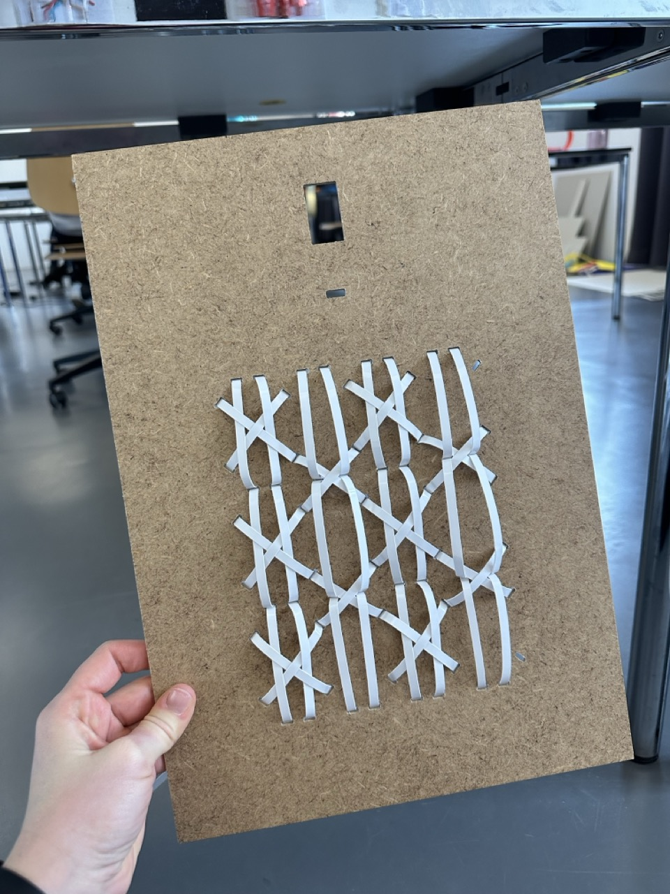
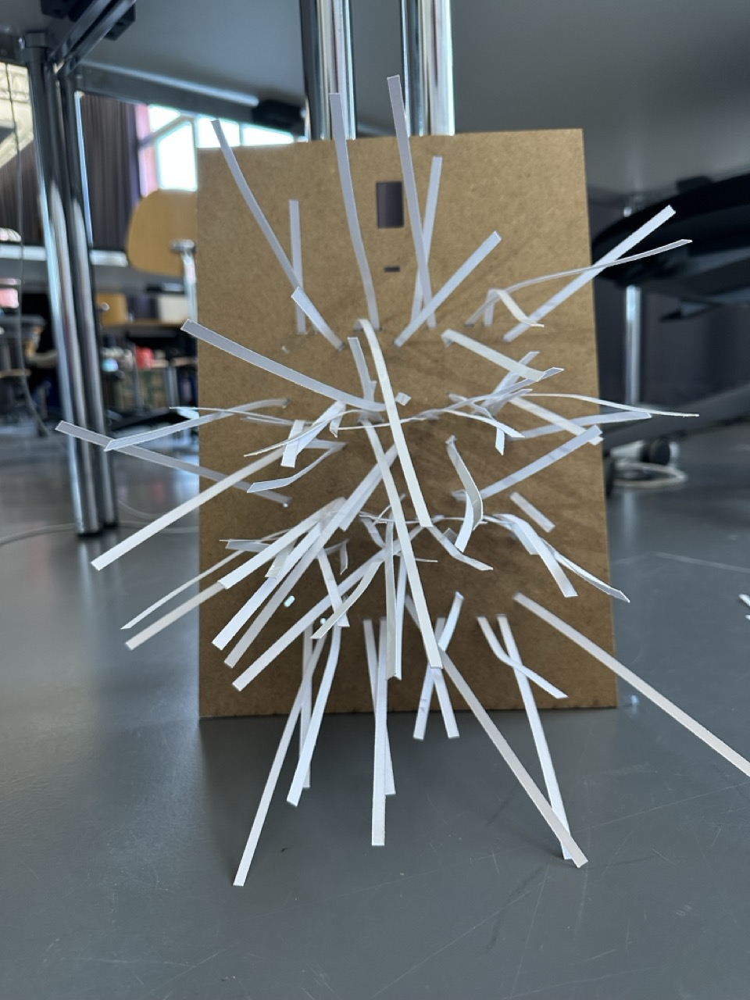
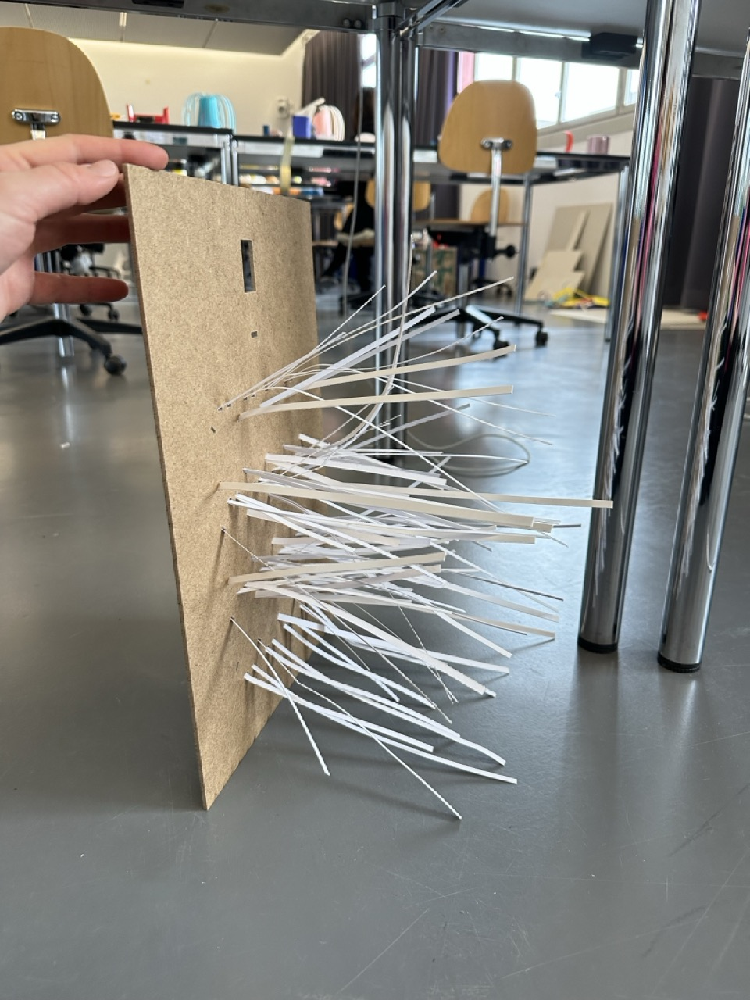
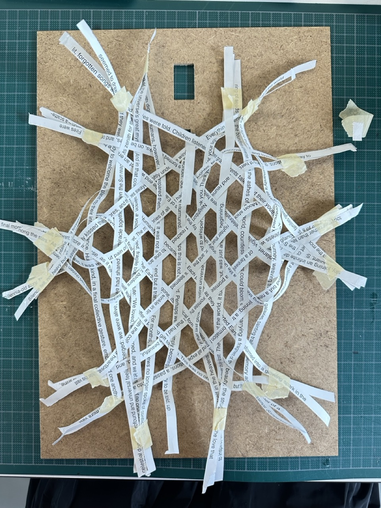
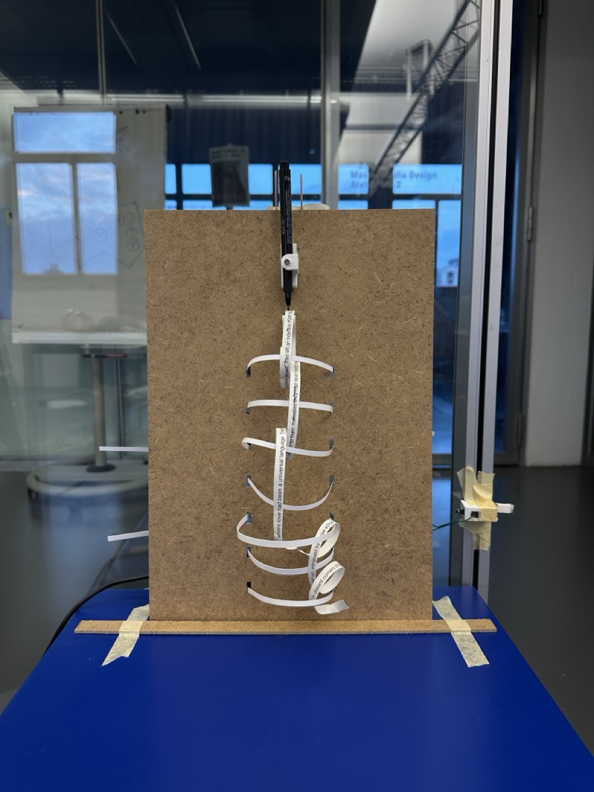
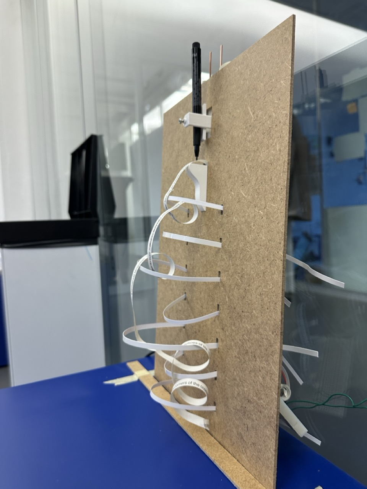
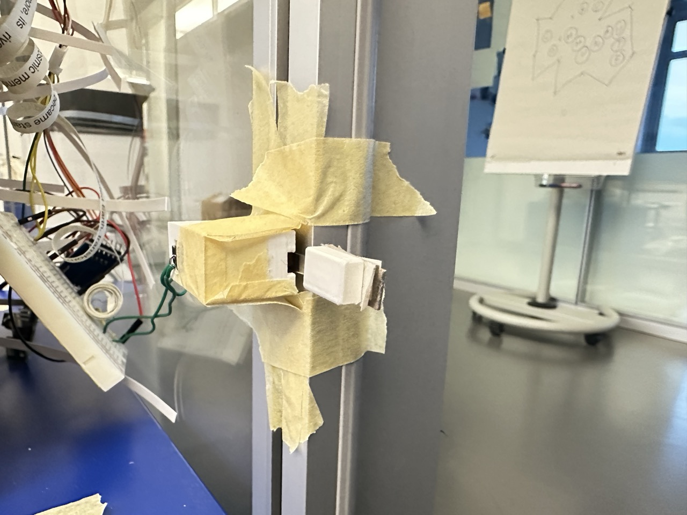
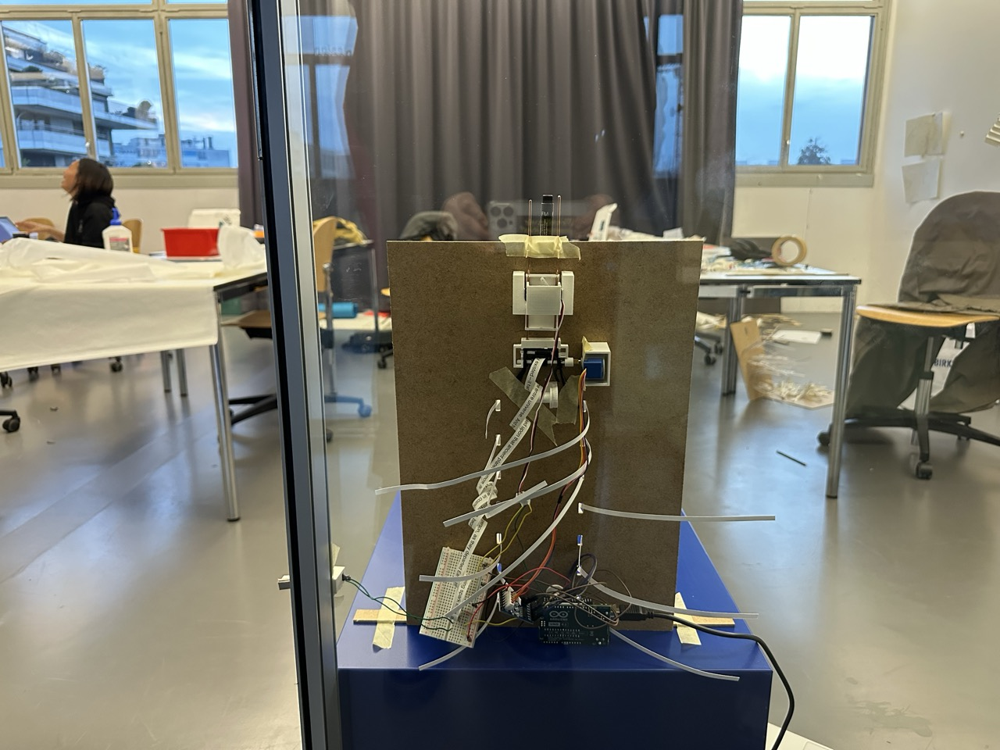

# Friday, december 13, 2024

## Testing the new mechanism

-> Working but still needs to be improved

## Cutting new MDF to try other paper shapes

## Testing with the door box all together

## Remaining mechanism issues

- Pen doesn't hold: Reprint a 3D holder with a hole that matches the drill bit's diameter and find a thicker screw. If not, make the same hole and go back to the metal workshop.
- Raise the paper roll: Place it higher and closer to the compressors. Add something that rotates smoothly and easily.
- Align the compressors with the hole: Find a way to position the compressors directly in front of the hole (maybe redo the MDF with more space between the holes?).
- Door box: Add more width in front of the clip and find a way to ensure the casing fits tightly against the door frame.

## Test day
**What to test?**  
- How the arrangement of the text makes people feel.  
- What emotions arise from receiving paper with traced text?  
- The different forms of weaving or strips.  
- Do they feel like doing something with it?  

**Test objectives:**  
- Understand how people react to receiving paper with text and crossed-out words, to help find text that aligns with the scenario.  
- Explore how people actively interact with the soft robot in different shapes.  

**Setup:**  
- One placed by the door on a locker.  
- Two others displayed on a table.  
- Strips of paper with crossed-out text to give participants at the beginning.  