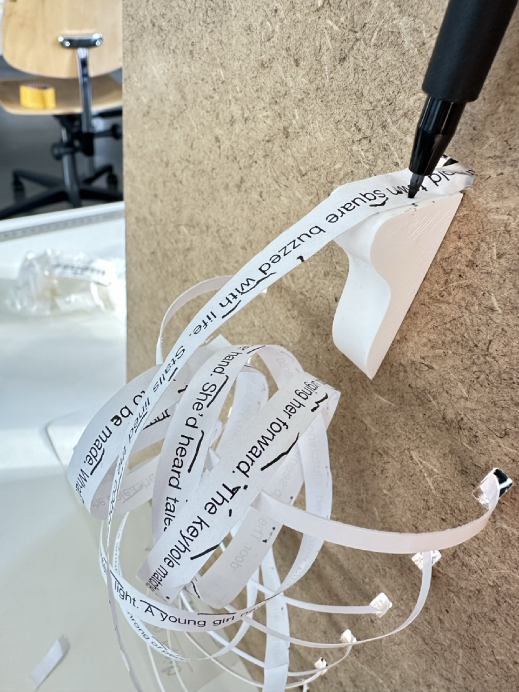

# Tuesday, december 17, 2024

## Test with the pen 

### Problems
- Top pressure roller moves to the right: find a locking system
- Add rails on the sides of the paper platform
- Paper always difficult to pass: reprint the platform on the front side with a mini 1mm end that passes through the hole to recover the paper on the other side
- Pen is not centered

## Test day preparation

### What do I want to test?
- The shape of my soft robot (how does it change the experience based on the different paper shapes)
- The text that is displayed on the strips

### What are the objectives of the test?

- See what shape will create what interactions with the participants -> to help me make a choice for the shape (identify the most interesting / coherent shape, how can it be developed?)
- Explore how the participants react to the crossed text they receive -> to help me define what kind of text I'm going to choose

### What are my hypotheses?

### Setup

### Material needed
- iPhone filming the scene
- Notepad for writing down answers

### Tasks
1. I will first ask them about their first impression. What context would they give to the robot, what do they think will happen?
   
2. I will then introduce the contexte of the robot : it is placed next to the front door, inside, and starts doing its thing when the door is open. So when you leave, when you come home, when you welcome guests, etc. 
I will also precise that all 3 examples of today are different possiblities of shapes.
I will ask them to tell me what they are doing and anything that goes through their mind during the experiment. Could be questions, feelings, toughts, etc. 

3. I will start with the first shape (the one with the pen holder), rolling the paper myself and puting the pen up and down. I will not say anything and let them play with it, see how they interact. 

4. Same for the 2 other shapes, but the strips of paper have already crossed words on them (I will tell participants to imagine the pen like in the first one)
5. I will then engage a discussion with them, asking the following questions, and registering the answers on the phone. 

### Post-test questionnaire 
- Reflecting on the interactions they had during the experiment, I will ask them to get more details about what they felt
- What differences did you felt with the three different shapes ?
- Does the robot have a personality to you ? Is it supposed to have a personality ? Who is talking to you ?
- What do you think these words are for ? What do you want to do with these words ? Did some of them speak to you? Do you remember one or some of them?
- What kinds of words would you like to receive when you get home ?
- Was there something confusing in this experience ? 

