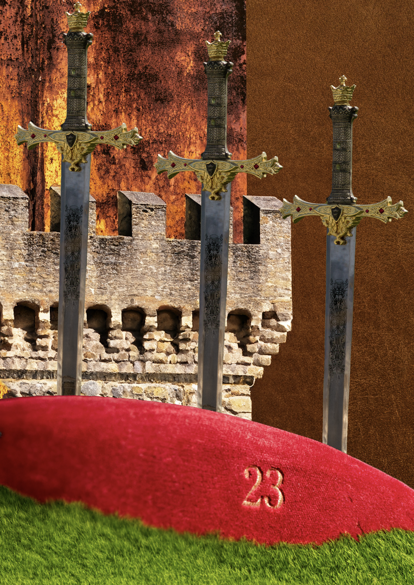

# January 02 - 05, 2025

## New paper rolls and shape
Choosed one of the personalities and created it. 

## New doubts, reflected on the personalities again
Felt like it didn't had any link with the entry space and the door anymore.
I also found out that all the personnalities I wanted to keep had a fun/humoristic aspect to them. So I decided to create or reframe the personnalities so that they respect these 2 caracteristics (fun & entry space related).
Now there are only 5 personnalities, but they feel more cohesive than before. 

## Visual emprovements
I want the robots to be all done with weaved paper so that they are linked together by the texture.
But to make them look different and increase their personnality, I decided to print some images on the paper that will be weaved. 

Test with 2 personnalities : 

### Light sleeper : 

### Visitor - Chevalier

## Storyboard for video

## Website creation
-> still need to do some adjustments and change the images.

https://tarahachler.github.io/unwanted-guests/ 