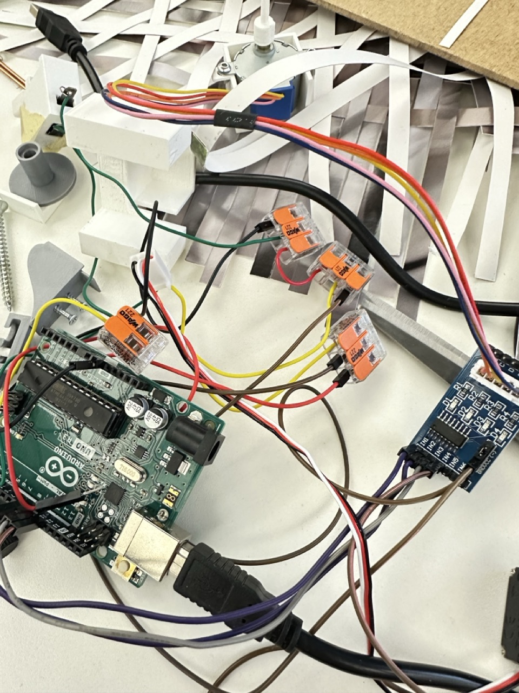

# Monday, january 06, 2025

## Discussion with Laure & Pierre
- Not pictures, only colors (mainly to save time)
- All personnalities need to have an object/tool because it's too complicated with the detachable upper part
- Box is better with MDF than 3D print
- The visible part where the paper goes through can be smaller, and have screws to attach to the MDF box
- The elements to attach to the wall can be inside the box 

## Other solution for soldering since I don't have any resistor on my breadboard

